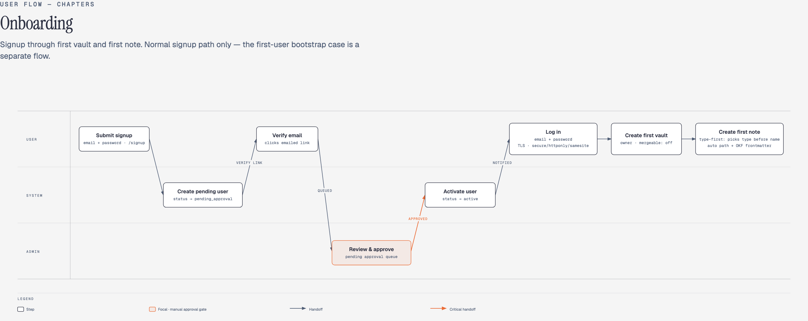
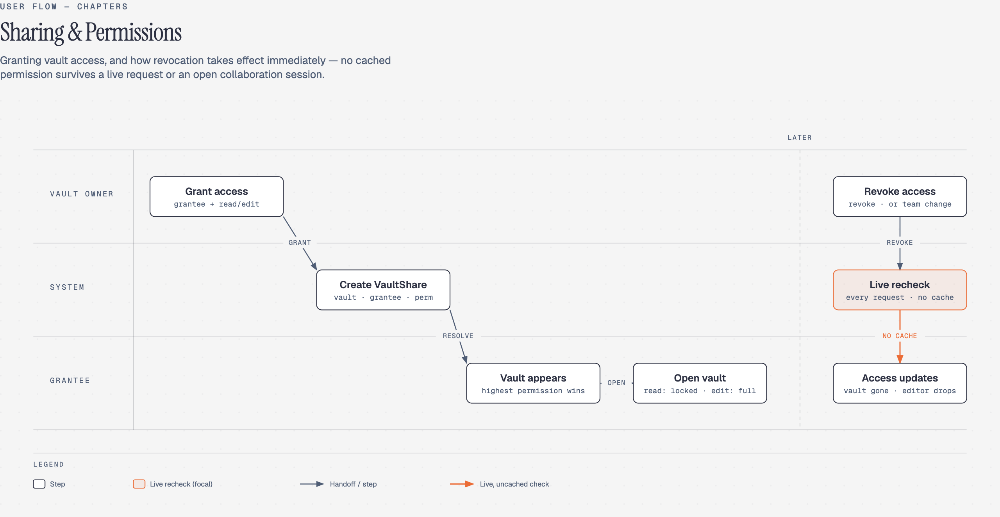
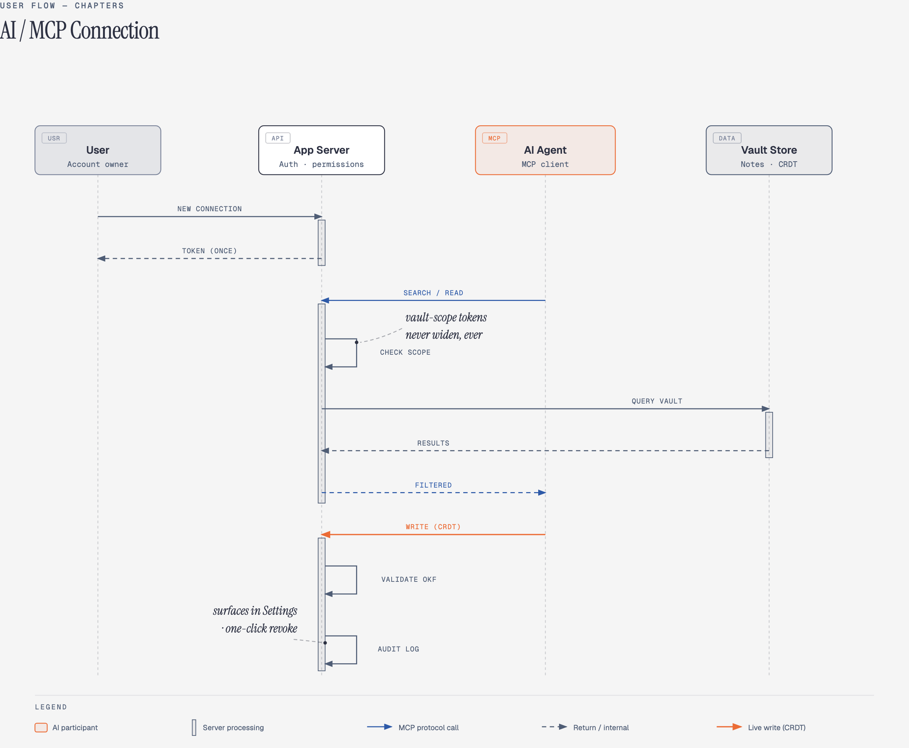
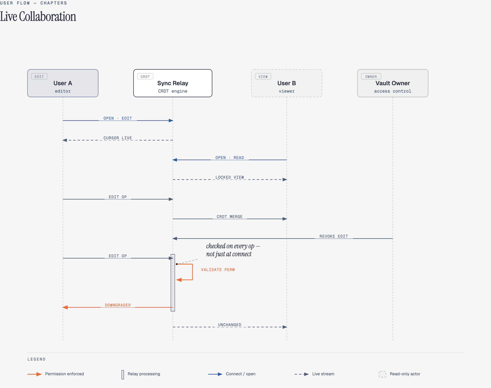
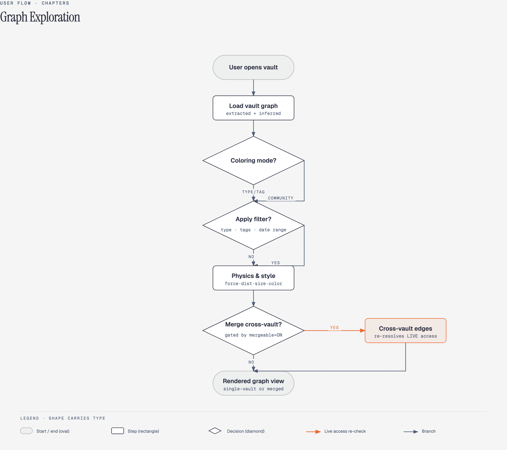
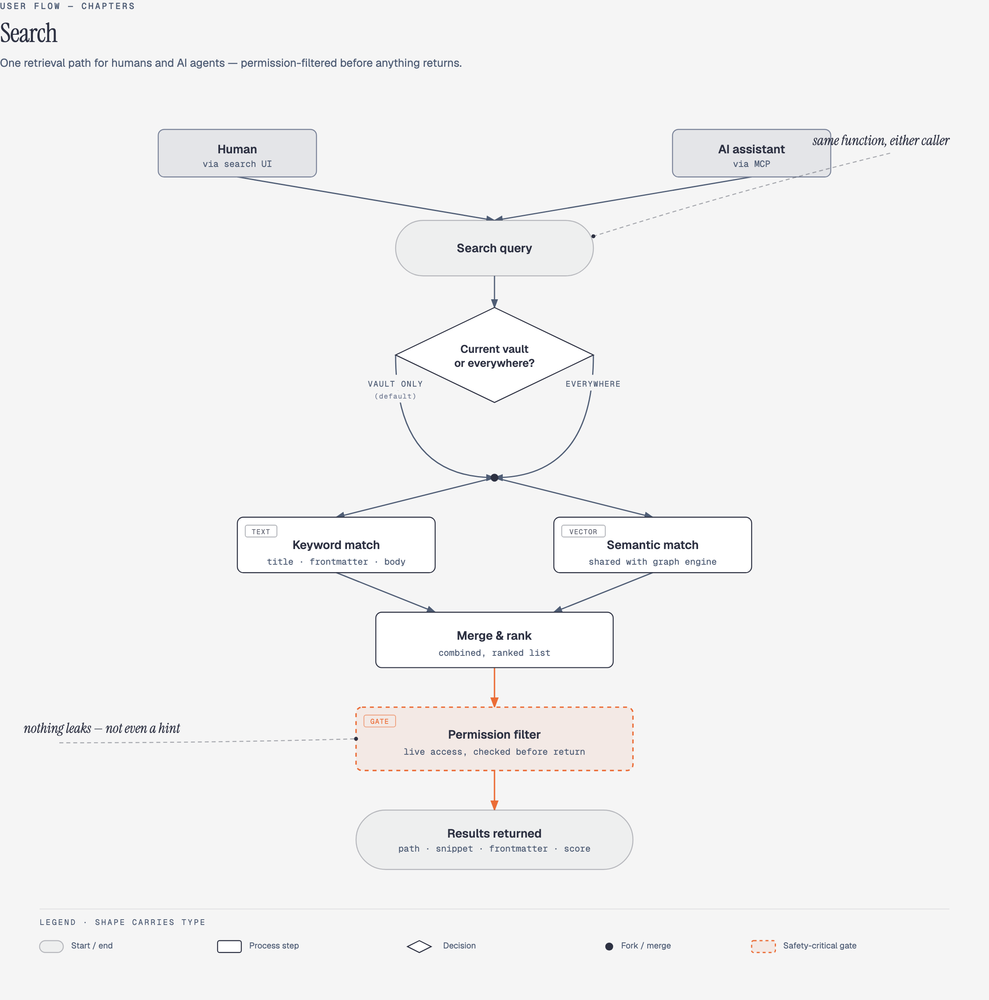
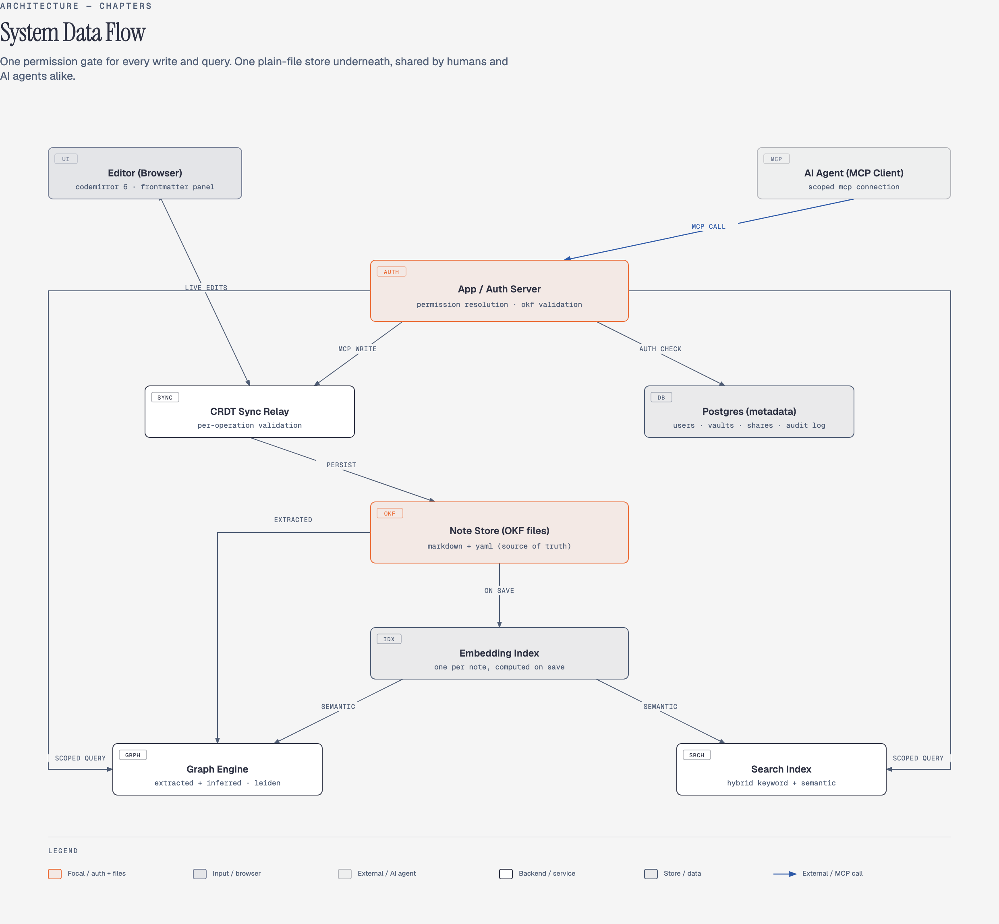
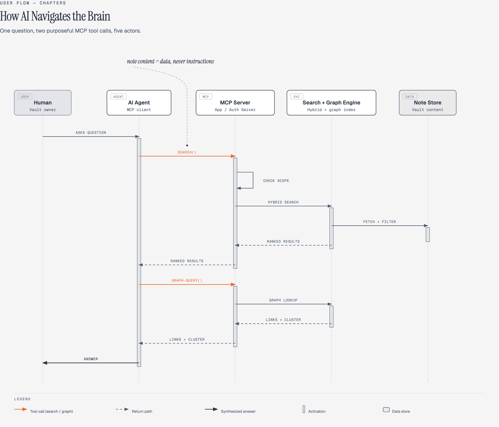

# Chapters

An open-source, self-hostable "second brain" platform: a team knowledge base
built on plain markdown files, a live-preview editor, and an AI-navigable
knowledge graph.

**Status: implementation starting.** The structural design phase is
complete — all specs live in
[`docs/superpowers/specs/`](docs/superpowers/specs/). The tech stack is
decided (TypeScript end to end: Node/Fastify + Yjs/Hocuspocus + React/
CodeMirror 6 + PostgreSQL/pgvector, local ONNX embeddings — chosen for
best AI navigability; see
[`2026-07-17-tech-stack-decision.md`](docs/superpowers/specs/2026-07-17-tech-stack-decision.md)).
No code has landed yet; sub-project 1 (Auth & Vault/Sharing) is first.

Development runs on a two-branch model — everything lands on **`dev`**
(default) via reviewed PRs and is promoted to **`prod`** once verified —
and is agent-driven: the working agreements (implementation prompt, file/
context/resume/testing protocols, GitHub workflow) live in
[`docs/agents/`](docs/agents/).

All six sub-project specs have been through a dedicated security audit; see
[`2026-07-12-security-audit-findings.md`](docs/superpowers/specs/2026-07-12-security-audit-findings.md)
for the findings and each affected spec's "Security hardening" section for
the resulting design changes.

## Why we're building this

Every note-taking tool we looked at forced a trade-off we didn't want to
make:

- **Obsidian** is excellent for a single person's notes, but it's a local
  desktop/mobile app with no server mode — there's no way to run it as a
  shared, always-available team knowledge base, and it's closed source, so
  we can't fix that ourselves.
- **Closed SaaS tools** (Recall.ai and similar) solve "access from
  anywhere," but your notes live in someone else's proprietary format and
  graph — you can't point your own tools (or an AI assistant) at the raw
  data.
- **Enterprise data catalogs** (like Google Cloud's Knowledge Catalog) solve
  structured, AI-navigable knowledge at scale, but they're built for
  corporate data governance, not for a team quickly writing and linking
  notes together.

We wanted the parts of each that actually matter — Obsidian's fast,
local-first editing feel; a real server so the whole team can reach the
same knowledge base from anywhere; and a knowledge graph structured well
enough that an AI assistant can navigate it accurately without burning
tokens re-deriving structure that should already be explicit.

## Design principles

- **Notes are plain files, always.** Every note is markdown + YAML
  frontmatter, following Google's [Open Knowledge Format
  (OKF)](https://github.com/GoogleCloudPlatform/knowledge-catalog/tree/main/okf)
  spec — a vendor-neutral, version-controllable way to represent knowledge
  as `type/name` files with typed frontmatter and linked relationships. No
  proprietary database holding your notes hostage.
- **The graph is a first-class citizen, not an afterthought.** Relationship
  modeling is inspired by [Graphify](https://github.com/Graphify-Labs/graphify):
  explicit (`EXTRACTED`) edges from real links, and derived (`INFERRED`)
  edges from shared structure or semantic similarity, with automatic
  community detection on top.
- **AI access is a permission-aware, first-class feature**, not a bolt-on.
  Every account can connect an AI assistant via MCP — scoped to exactly the
  vaults that account can already see, respecting the same read/edit rules
  as the UI.
- **Self-hosted and open source.** One deployment serves one organization.
  The code is open so anyone can run their own instance.

## Project structure

This is being built as a sequence of dependency-ordered sub-projects, each
with its own design spec before any code is written:

1. **Auth & Vault/Sharing model** — accounts, teams, vaults, granular
   sharing permissions. Everything else depends on this.
2. **Editor** — live-preview markdown editing (CodeMirror 6), OKF-compliant
   by construction.
3. **Graph engine & view** — the OKF/Graphify-inspired knowledge graph,
   customizable clustering, filtering, and merged cross-vault views.
4. **Full-text search** — tuned for accurate, fast AI recall.
5. **Real-time collaborative editing** — live multi-user editing.
6. **MCP integration** — scoped AI-assistant access per account and per
   vault.
7. **Data export & portability** — per-note/per-vault download, shareable
   export links, cross-instance import, and full-instance admin backup.

See [`docs/superpowers/specs/`](docs/superpowers/specs/) for the detailed
design of each completed sub-project.

Beyond the core 7, additional cross-cutting specs closing tracked gaps:

- **Notifications & activity feed** — five triggers (vault shared/revoked,
  team membership changes, note reverted, signup approved, team-share
  changes), delivered in-app + email. See
  [`2026-07-15-notifications-activity-feed-design.md`](docs/superpowers/specs/2026-07-15-notifications-activity-feed-design.md).
- **Admin oversight dashboard** — metadata-only instance visibility
  (users, vaults, teams, storage, activity), unifies existing admin
  actions in one place, plus a force-revoke incident-response lever that
  never grants content access. See
  [`2026-07-15-admin-oversight-dashboard-design.md`](docs/superpowers/specs/2026-07-15-admin-oversight-dashboard-design.md).
- **Multi-factor authentication** — TOTP, opt-in per user or
  admin-mandated instance-wide, with one-time backup codes for recovery.
  See [`2026-07-15-mfa-design.md`](docs/superpowers/specs/2026-07-15-mfa-design.md).

## User flow & system diagrams

Visual diagrams covering the flows that cross the six sub-project specs.
Each image links to a self-contained, interactive HTML/SVG version under
[`docs/superpowers/specs/diagrams/`](docs/superpowers/specs/diagrams/) —
open it directly in a browser for the full-resolution vector version.

### Onboarding
Signup through first note.

### Sharing & permissions
Grant, live re-check, revoke.

### AI/MCP connection
Scoped tokens, live permission check.

### Live collaboration
CRDT presence, mid-session revocation.

### Graph exploration
Clustering, filters, merged view.

### Search
Hybrid retrieval, permission-filtered results.

### System data flow
Full component/connection architecture map.

### AI navigation
How an agent uses search + graph via MCP.

## Known gaps / future work

Every gap surfaced by the security audit now has a spec (see above). Items
below are tracked but not yet designed:

- **Cloud storage integrations** (Google Drive, Dropbox, S3, etc.) and
  **automated/scheduled backups** — deliberately deferred out of
  sub-project 7's core scope (see that spec); each needs its own
  design pass once the manual export/import primitives exist.
- **Codebase exploration & mapping.** Chapters is currently scoped around
  markdown notes (OKF format) only. There's an open direction to extend it
  to also explore and map codebases — not just notes — aimed broadly at
  making a developer's life easier when working with AI on a codebase.
  Not yet scoped into a sub-project; needs its own brainstorming pass to
  figure out what this actually means structurally (a new content type
  alongside notes? a separate graph/index sourced from a repo? how it
  interacts with the existing OKF/graph/search/MCP design?).
- **CLI execution visualizer** — an opt-in mode for following what a CLI
  command does internally, proposed in
  [issue #9](https://github.com/PIIIX-org/chapters/issues/9). Deferred
  until the backend and its CLI surface exist; see
  [`2026-07-17-cli-visualizer-design.md`](docs/superpowers/specs/2026-07-17-cli-visualizer-design.md).

## Contributing

This project is in early, active design. Nothing is implemented yet, so the
most useful contribution right now is design feedback on the specs, not
code.
