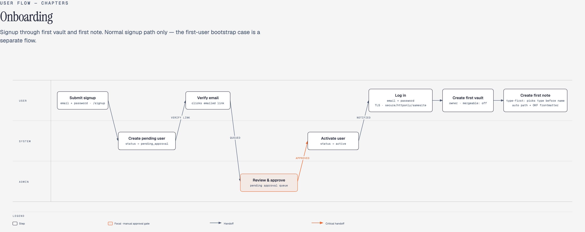
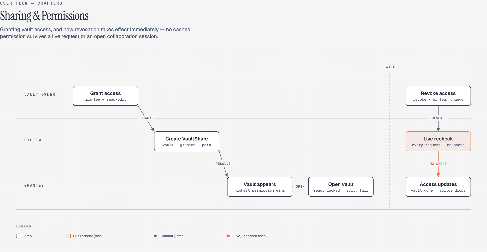
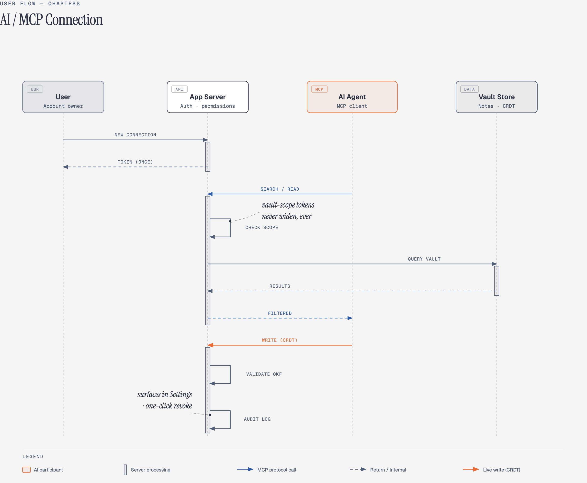
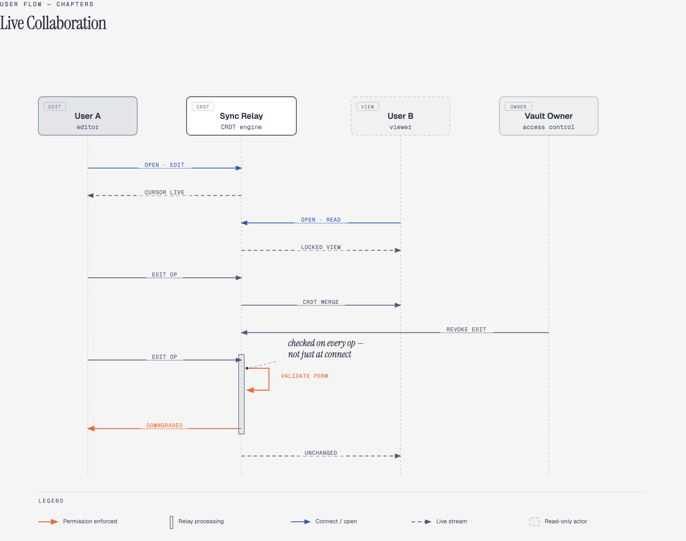
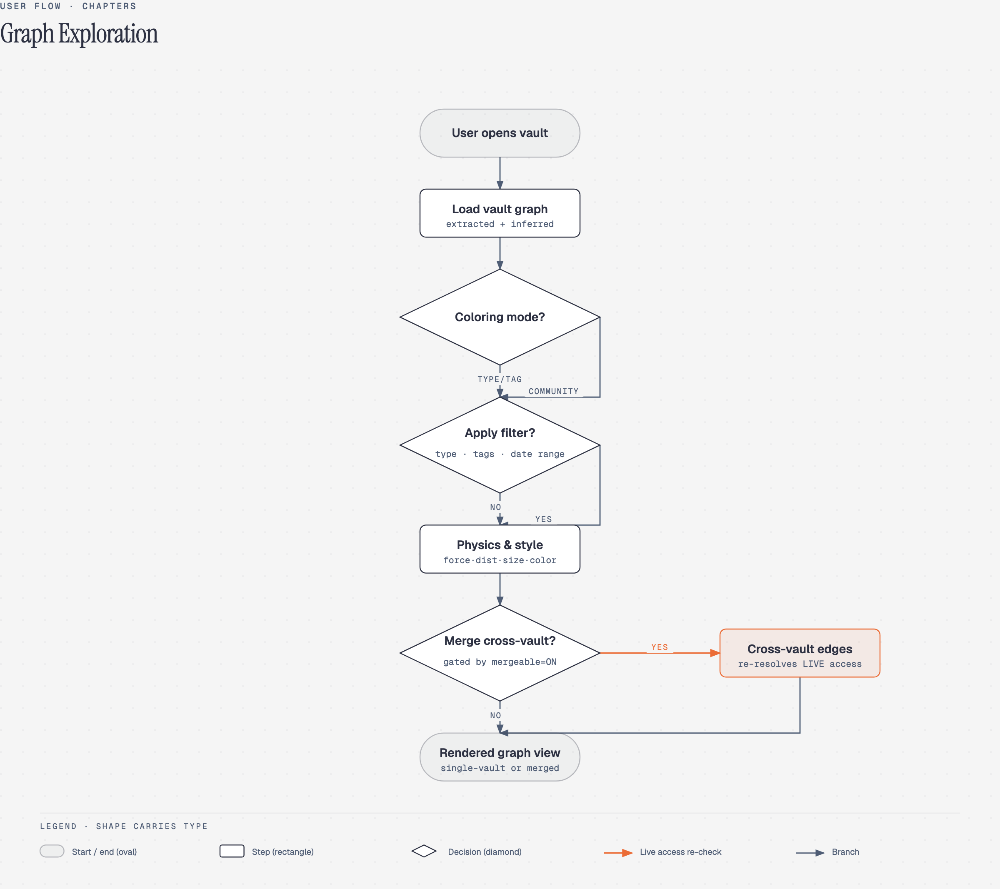
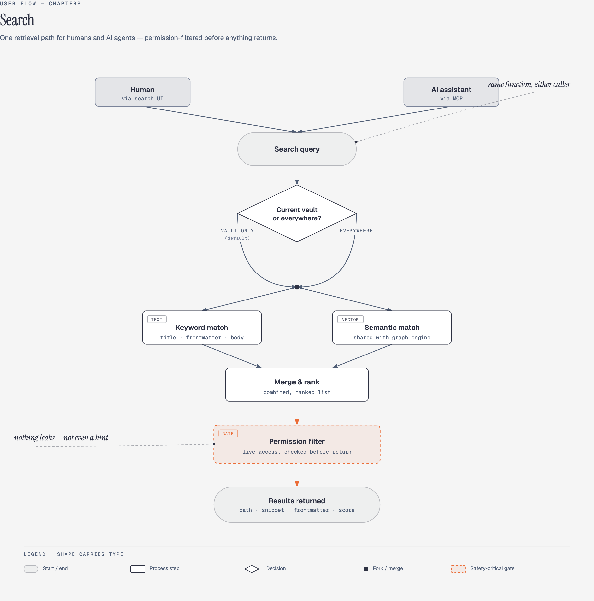
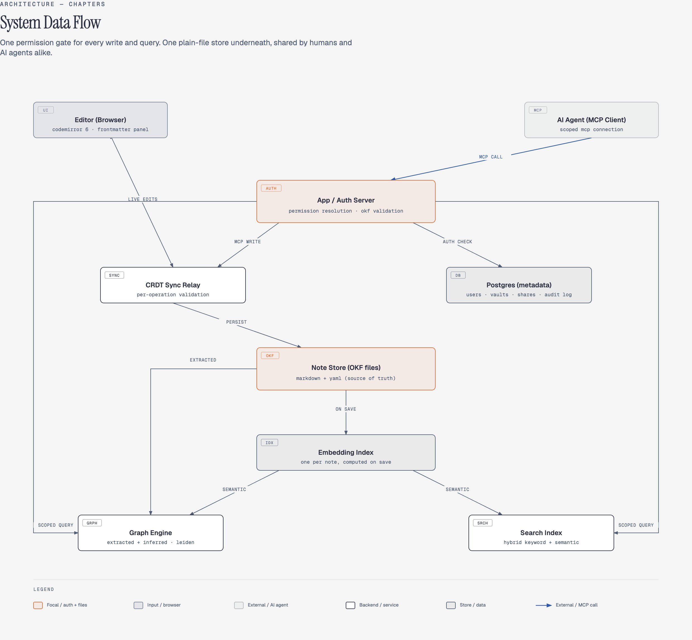
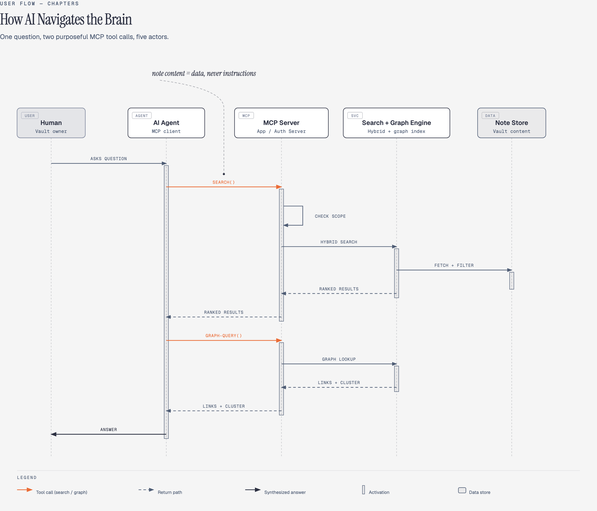

# Chapters

An open-source, self-hostable "second brain" platform: a team knowledge base
built on plain markdown files, a live-preview editor, and an AI-navigable
knowledge graph.

**Status: backend complete; UI phase underway. Slice 1 (Scaffold + Auth),
Slice 2a (vault tree + read-only view), Slice 2b (Editor — CodeMirror 6
editing, permission-aware lock, editable frontmatter property panel, note
create/rename/delete, and full live-preview), Slice 2c (wikilinks —
`[[` autocomplete, clickable navigation, and link-to-create), Slice 3
(Search — a ⌘K overlay with vault-scoped and everywhere search, type/tag/
date filters, navigation and vault-create commands, code results with an
inline preview toggle, and full keyboard navigation), and Slice 4/Unit 2
(Sharing & team — the vault settings modal stack and a dedicated Team
page, both reachable from ⌘K) are done.** All specs
([`docs/superpowers/specs/`](docs/superpowers/specs/)) are implemented
server-side on the decided stack (TypeScript end to end: Node/Fastify +
Yjs/Hocuspocus + PostgreSQL/pgvector + local ONNX embeddings — chosen
for best AI navigability, see
[`2026-07-17-tech-stack-decision.md`](docs/superpowers/specs/2026-07-17-tech-stack-decision.md)):

- **Auth & sharing** — setup-token bootstrap, signup→verify→approve,
  sessions, teams, vault shares with live permission resolution, MFA
  (TOTP + backup codes, admin-mandatable)
- **Notes** — plain OKF markdown files on disk, one shared server-side
  validation for every write path, soft-delete trash, per-type index.md
- **Vaults** — owner-only soft delete (`DELETE /api/vaults/:id`), trash
  listing and restore (`GET /api/vaults/trash`, `POST /api/vaults/:id/restore`,
  409 if not trashed), and hard purge (`POST /api/vaults/:id/purge`, only
  once trashed), matching the note purge contract: clears semantic edges
  explicitly and removes the vault's directory from disk
- **Graph & search** — save-time embedding index; extracted/structural/
  semantic edges with Louvain communities and an opt-in merged
  cross-vault view; hybrid keyword+semantic search, permission-filtered
  in-query. Semantic edges are stored directed — each node owns the rows
  for its own top-k, read back undirected — and are cleared explicitly
  when a note is purged or a repository file disappears (the table is
  polymorphic, so nothing cascades); migration `0010` mirrors
  pre-existing rows, so no edge is lost on upgrade. `?aggregate=community`
  collapses a vault's or repository's graph into one super-node per
  Louvain community (size, note/code counts, most-recent activity);
  tapping one sends `?community=<n>` back to the same graph endpoint to
  drill down to just that community's members and edges. Each vault/
  repository also has a `GET`/`PUT .../graph-preference` toggle
  controlling whether it's included in the merged cross-vault view. The
  client's Home renders this as a hand-rolled Canvas 2D scene — no graph
  library — laid out by `d3-force` (the one new runtime dependency this
  view adds) and panned/pinched by a ~55-line Pointer Events module;
  `GraphCanvas` loads as its own lazy chunk, never the initial bundle.
  `prefers-reduced-motion` settles the layout in rAF-sized batches of at
  most 20 ticks per frame behind the loading skeleton instead of blocking
  the main thread, then paints once and stops — a settled graph draws
  nothing until the next pan, zoom, or physics change. A failed vaults or
  graph fetch renders a plain-language error with a working Retry (never a
  blank canvas, and checked before the empty-state length test so a failed
  fetch can't fall through and render a stale graph); a successful fetch
  with zero nodes renders "Nothing to draw yet" with a route to create a
  note, since an empty graph is not an error; oversized structural groups
  the server refuses to build pairwise edges for
  (`cappedGroups`, `graph/assemble.ts`) surface as a named, non-blocking
  notice instead of a silently thinner graph; and a drill-down capped at
  ~2500 members states "Showing N of M notes in this community" rather
  than truncating silently
- **Real-time collaboration** — Yjs relay with per-operation live
  permission checks, instant revocation kick, and an identity-free live
  view for read-only users
- **MCP** — permission-scoped AI access with full tool parity, writes
  flowing through the live collaboration engine, attributed audit trail
  with revert and hard purge, per-connection rate limits
- **Export & portability** — zip exports with manifest, expiring share
  links, validated import, full-instance admin backup and a matching
  `pnpm restore-backup` CLI (deliberately not an HTTP endpoint) for
  disaster recovery onto a fresh instance; a note whose file is missing
  from disk is recovered from its database row rather than failing the run
- **Admin oversight** — metadata-only dashboards and instance-wide
  force-revoke; never note content

**Codebase mapping** is also implemented, extending the platform beyond
notes to also index and query code — read-only, sharing the same graph/
search/MCP engines rather than a parallel one:

- **Repository ingestion & permissions** — connect a codebase via git
  URL (shallow clone + webhook/poll freshness), a local path (real-time
  filesystem watch), or an agent/CLI push, and share it read-only the
  same way a vault is shared. See
  [`2026-07-18-repository-ingestion-design.md`](docs/superpowers/specs/2026-07-18-repository-ingestion-design.md).
- **Code graph & unified search/MCP** — tree-sitter-derived import and
  symbol structure; `buildGraph`/`searchNotes` extended to span both
  vaults and repositories (one function, every caller); semantic edges
  between a note and the code it describes, since both share one
  embedding space; a `repo:` wikilink form links notes directly to
  code; MCP gains repository-aware tools and a hard-scoped connection
  type. See
  [`2026-07-18-code-graph-integration-design.md`](docs/superpowers/specs/2026-07-18-code-graph-integration-design.md).

The UI (React + CodeMirror 6) is underway — Slice 1 (Scaffold + Auth),
Slice 2a (vault tree + read-only note view), and Slice 2b (the Editor —
CodeMirror 6 editing, permission-aware lock, editable frontmatter property
panel, note create/rename/delete, and full live-preview) and Slice 2c
(wikilinks — autocomplete, clickable navigation, link-to-create), Slice 3
(Search — the ⌘K overlay), Slice 4/Unit 2 (Sharing & team — the vault
settings modal stack and the Team page), Unit 3 (Admin & the onboarding path)
Unit 4 (Settings & MFA), Unit 5 (Trash, history & import), Unit 6
(Collaboration) and Unit 7 (Repositories) are done — the UI phase is complete.
Tracked in [`docs/agents/STATE.md`](docs/agents/STATE.md).

**Running it**: `Dockerfile` (repo root) + `server/.env.example` cover a
real deployment — security headers on by default, CORS off (same-origin
only) unless `CORS_ORIGIN` is set, Dependabot watching dependencies. One
real constraint worth knowing before scaling: this backend assumes a
single running instance (lockout counters, the embedding/extraction
queues, the live-collaboration permission-kick bus, MCP rate limiting,
and repository polling are all in-process state) — see
[`docs/agents/implementation.md`](docs/agents/implementation.md)'s
"Deployment topology" section before running more than one instance.

The frontend (`client/`) is a Vite + React app. In development, run the
API (`pnpm -C server dev`) and the frontend (`pnpm -C client dev`)
side by side — Vite proxies `/api/*` to the API on port 3000, so no CORS
configuration is needed locally. `pnpm -C client build` produces a static
`client/dist/` bundle to serve behind the same reverse proxy as the API in
production.
Logged-in users can browse their vaults and edit notes with a real
CodeMirror 6 editor (`/vaults/:id/notes/*`, debounced autosave) plus a
structured property panel for the note's frontmatter (`type` shown
read-only, `resource`/`tags`/`timestamp` editable, extra keys preserved);
read-only collaborators get the same note rendered but locked. Edit-capable
users can create notes from the sidebar via a type-first flow (pick or name
a `type`, then the note name), and rename or delete a note inline from the
file tree. The editor renders markdown formatting inline — headings, bold,
italic, inline code, and links are styled as you type — and the raw syntax
markers (`#`, `**`, `` ` ``) hide when the cursor leaves the line and
reappear when you move back onto it (live-preview). Typing `[[` autocompletes
against the vault's note paths, and a `[[link]]` you're not editing is
clickable — it navigates to that note, or, if the note doesn't exist yet,
creates it (type-first, from the path) and opens it. Pressing ⌘K (Ctrl+K)
anywhere opens a search overlay (hybrid keyword + semantic) with a scope
toggle at the top — search "Everywhere" you can reach, or narrow to the
vault currently active in the shell's scope picker, since both controls
read and write the same `vault` URL param. Below it, the same type/tag/date
filter panel used by the graph view narrows results further, with the
option lists always including whatever's currently selected even if it's
dropped out of the loaded result set — so a filter is never stuck on with
no checkbox left to turn it off. The overlay also lists navigation and
vault-create commands above the results (prefixed distinctly, filtered as
you type), renders code matches with an inline snippet preview you toggle
open, and is fully operable by keyboard — arrow keys move through commands
and results in one list, Enter activates whichever is highlighted, Escape
closes. A notification bell sits top-right on every page (the shell's
`data-slot="notifications"` slot), its accessible name carrying the unread
count (e.g. "Notifications, 2 unread") derived from rows with no `readAt`
in the fetched page; opening it drops a drawer feed listing each
notification's message, a monospaced timestamp, and a "Mark as read"
button on unread rows, with the failed-fetch state (an alert with Retry)
checked before the empty "No notifications yet." state so the same
fetch-ordering trap the graph view guards against can't hide a broken
request behind an empty feed.

Unit 2 (Sharing & team) adds a per-vault settings modal stack — opened from
the vault view — covering sharing (grant/revoke, live-updated), the
mergeable-into-cross-vault-graph toggle, vault-scoped MCP connections
(one-time token reveal, same pattern as the sync tokens), and a per-vault
export download; every revoke or removal confirms inline with its actual
consequence rather than a bare "Are you sure?". Alongside it, a Team page
(`/team`, reachable only via ⌘K — there is no persistent left nav) shows an
aggregate-only roster (no note content, ever) with each member's vault
count and last-activity date, team management (create/rename, add/remove
members), and a "who can reach this vault" expansion per vault. The client
leans on two new endpoints for this: `GET /api/users/lookup?email=` (exact
match only, active users only, never a directory listing — used to resolve
an email to a user before adding them to a team) and
`GET /api/teams/:id/stats` (aggregate counts only, scoped to vaults the
caller can already see).

Unit 3 (Admin & the onboarding path) closes the hole that kept anyone but
the bootstrap admin out of an instance: signup leaves an account
`pending_approval` with an unverified email, login requires both to be
settled, and approval had no UI at all. `/admin` (admins only, reachable
via ⌘K) now carries the approval queue, a user roster with promote and
deactivate, vault and team oversight with ownership reassignment, an access
view listing every share and every MCP connection on the instance with
force-revoke on each, the security-event log and content audit trail (both
paginated), aggregate instance stats, and the instance backup download.
Everything there is metadata: it shows *who changed which note when*, never
what the change said — no admin, on any instance, can read a note they have
not been given access to, and no endpoint behind the page serves one.
Restore stays a CLI (`pnpm restore-backup`) on purpose; restoring over a
live instance is not a button. The signup and verify-email screens now say
plainly that an administrator must approve the account, while the login
error stays a generic "invalid credentials" — naming the reason there would
tell a stranger whether an address has an account.

Unit 4 (Settings & MFA) adds `/settings` — every account's own page, reachable
via ⌘K. Two-factor authentication is TOTP from an authenticator app: enrolling
shows the secret and an `otpauth://` URI, and on success the one-time backup
codes appear exactly once, through the same reveal component MCP tokens use.
An admin can require two-factor instance-wide from the admin area; while that
is on, anyone without an authenticator is sent to enrol before they can reach
anything else, and nobody can turn their own off — so the page hides the
disable control entirely rather than offering a button the server will refuse.
Alongside it: changing your email (which clears verification and mails a new
code, so the screen says plainly that sign-in will fail until you enter it),
changing your password (every other device is signed out, yours is not), a
single switch for notification emails, the account-wide MCP connection list —
literally the same component as the vault-scoped one, in a different scope —
and an export of every vault you own.

Notification preferences are deliberately **one switch, not a matrix**: the
notifications spec puts per-type preferences and digests explicitly out of
scope, and the in-app feed is not switchable at all because it is the
historical record that spec depends on. Turning the switch off stops the
emails and nothing else.

Unit 5 (Trash, history & import) makes deleted work recoverable. A deleted
note now goes to a trash list in the vault settings modal and comes back from
it; a vault in the trash can finally be purged, which its own delete
confirmation had been promising since Slice 1 with no control anywhere to do
it. The Editor gains a history rail: every revision with when and **who** —
and *who* is the point, since a revision written by a person reads vermillion
and one written by AI through MCP reads teal. Reverting writes the old content
back as a new revision attributed to you rather than erasing anything, and the
confirmation says so. Owners can purge a single recorded revision, which is
the one genuinely irreversible action here.

Import is the counterpart to the account export, directly beneath it in
Settings. It **always creates a new vault** — it never merges into an existing
one — and the result reports the notes it could not parse, with the reason for
each, alongside anyone named in the archive's manifest who has no account on
this instance and therefore silently got no access.

Unit 6 (Collaboration) turns the editor into a shared one. Everyone holding
`edit` on a note joins a single Yjs document over the Hocuspocus relay: there
is no autosave `PUT` any more and no local copy of the body — the CRDT *is* the
note, which is what closes the lost-update race (#66) by construction rather
than mitigating it. Collaborators' carets taper to a pen nib in one of five ink
hues hashed from their id, with a name tag that fades after a moment of
stillness, and their initials appear in the Editor top bar — there only, never
a global "who's online" list. Sync state whispers in the breadcrumb, never a
modal. Read-only viewers get the same content live over SSE without ever
joining the document, so they broadcast no cursor and no identity.

Two states are worth knowing about because they are easy to confuse. **Revoked**
means access was taken away: the editor locks and says so, and the document is
never destroyed, so anything typed but unsent is still on screen to copy out.
**Offline** means the relay could not be reached — nothing was taken away, the
note is shown read-only from the last saved copy, and it retries on its own.

**Deploying it** needs nothing in particular. The relay rides the app's own
HTTP server on `/collab`, so there is one process listening on one port and no
websocket routing to configure — in development or in production.

**Getting in** is a four-step route, and the app shows you where you are on it:
create an account, confirm your email, wait for an administrator on that
instance to approve you, then sign in. The third step is the one you cannot do
anything about, so the app says who has to act and that you will be emailed
when they do — because the sign-in screen deliberately will not tell you. An
unapproved account gets a plain "your email or password is wrong" there, since
saying "pending approval" would confirm to a stranger that an address has an
account on this instance.

Development runs on a two-branch model — everything lands on **`dev`**
(default) via reviewed PRs and is promoted to **`prod`** once verified —
and is agent-driven: the working agreements (implementation prompt, file/
context/resume/testing protocols, GitHub workflow) live in
[`docs/agents/`](docs/agents/). For a full technical walkthrough of the
backend — every subsystem, the data model, security posture, testing/
deployment, and a maintenance runbook — see
[`docs/agents/backend-reference.md`](docs/agents/backend-reference.md).

All six sub-project specs have been through a dedicated security audit; see
[`2026-07-12-security-audit-findings.md`](docs/superpowers/specs/2026-07-12-security-audit-findings.md)
for the findings and each affected spec's "Security hardening" section for
the resulting design changes.

## Why we're building this

Every note-taking tool we looked at forced a trade-off we didn't want to
make:

- **Obsidian** is excellent for a single person's notes, but it's a local
  desktop/mobile app with no server mode — there's no way to run it as a
  shared, always-available team knowledge base, and it's closed source, so
  we can't fix that ourselves.
- **Closed SaaS tools** (Recall.ai and similar) solve "access from
  anywhere," but your notes live in someone else's proprietary format and
  graph — you can't point your own tools (or an AI assistant) at the raw
  data.
- **Enterprise data catalogs** (like Google Cloud's Knowledge Catalog) solve
  structured, AI-navigable knowledge at scale, but they're built for
  corporate data governance, not for a team quickly writing and linking
  notes together.

We wanted the parts of each that actually matter — Obsidian's fast,
local-first editing feel; a real server so the whole team can reach the
same knowledge base from anywhere; and a knowledge graph structured well
enough that an AI assistant can navigate it accurately without burning
tokens re-deriving structure that should already be explicit.

## Design principles

- **Notes are plain files, always.** Every note is markdown + YAML
  frontmatter, following Google's [Open Knowledge Format
  (OKF)](https://github.com/GoogleCloudPlatform/knowledge-catalog/tree/main/okf)
  spec — a vendor-neutral, version-controllable way to represent knowledge
  as `type/name` files with typed frontmatter and linked relationships. No
  proprietary database holding your notes hostage.
- **The graph is a first-class citizen, not an afterthought.** Relationship
  modeling is inspired by [Graphify](https://github.com/Graphify-Labs/graphify):
  explicit (`EXTRACTED`) edges from real links, and derived (`INFERRED`)
  edges from shared structure or semantic similarity, with automatic
  community detection on top.
- **AI access is a permission-aware, first-class feature**, not a bolt-on.
  Every account can connect an AI assistant via MCP — scoped to exactly the
  vaults that account can already see, respecting the same read/edit rules
  as the UI.
- **Self-hosted and open source.** One deployment serves one organization.
  The code is open so anyone can run their own instance.

## Project structure

This is being built as a sequence of dependency-ordered sub-projects, each
with its own design spec before any code is written:

1. **Auth & Vault/Sharing model** — accounts, teams, vaults, granular
   sharing permissions. Everything else depends on this.
2. **Editor** — live-preview markdown editing (CodeMirror 6), OKF-compliant
   by construction.
3. **Graph engine & view** — the OKF/Graphify-inspired knowledge graph,
   customizable clustering, filtering, and merged cross-vault views.
4. **Full-text search** — tuned for accurate, fast AI recall.
5. **Real-time collaborative editing** — live multi-user editing.
6. **MCP integration** — scoped AI-assistant access per account and per
   vault.
7. **Data export & portability** — per-note/per-vault download, shareable
   export links, cross-instance import, and full-instance admin backup.
8. **Repository ingestion & permissions** — connecting a codebase
   (git URL, local path, or agent/CLI push), kept fresh, shared read-only
   the same way a vault is. See
   [`2026-07-18-repository-ingestion-design.md`](docs/superpowers/specs/2026-07-18-repository-ingestion-design.md).
9. **Code graph & unified search/MCP integration** — tree-sitter-derived
   code structure joining the existing graph/search/MCP engines, so notes
   and code are one navigable, queryable knowledge base. See
   [`2026-07-18-code-graph-integration-design.md`](docs/superpowers/specs/2026-07-18-code-graph-integration-design.md).

See [`docs/superpowers/specs/`](docs/superpowers/specs/) for the detailed
design of each completed sub-project.

Beyond the core 7, additional cross-cutting specs closing tracked gaps:

- **Notifications & activity feed** — five triggers (vault shared/revoked,
  team membership changes, note reverted, signup approved, team-share
  changes), delivered in-app + email. The signup-approved mail is the
  welcome: activation confirmation plus what else PIIIX makes, one mail
  rather than a transactional one followed by a marketing one — copy in
  [`server/src/email/welcome.ts`](server/src/email/welcome.ts), gated by the
  same `emailNotifications` opt-out as every other mail. See
  [`2026-07-15-notifications-activity-feed-design.md`](docs/superpowers/specs/2026-07-15-notifications-activity-feed-design.md).
- **Admin oversight dashboard** — metadata-only instance visibility
  (users, vaults, teams, storage, activity), unifies existing admin
  actions in one place, plus a force-revoke incident-response lever that
  never grants content access. See
  [`2026-07-15-admin-oversight-dashboard-design.md`](docs/superpowers/specs/2026-07-15-admin-oversight-dashboard-design.md).
- **Multi-factor authentication** — TOTP, opt-in per user or
  admin-mandated instance-wide, with one-time backup codes for recovery.
  See [`2026-07-15-mfa-design.md`](docs/superpowers/specs/2026-07-15-mfa-design.md).
- **Hosted UI structure** — page-by-page IA, user flows, and component
  placement for the hosted app, where the Yildizim galaxy layer is Home
  and 2D pages frame the work. See
  [`2026-07-17-hosted-ui-structure-design.md`](docs/superpowers/specs/2026-07-17-hosted-ui-structure-design.md).

## User flow & system diagrams

Visual diagrams covering the flows that cross the six sub-project specs.
Each image links to a self-contained, interactive HTML/SVG version under
[`docs/superpowers/specs/diagrams/`](docs/superpowers/specs/diagrams/) —
open it directly in a browser for the full-resolution vector version.

### Onboarding
Signup through first note.

### Sharing & permissions
Grant, live re-check, revoke.

### AI/MCP connection
Scoped tokens, live permission check.

### Live collaboration
CRDT presence, mid-session revocation.

### Graph exploration
Clustering, filters, merged view.

### Search
Hybrid retrieval, permission-filtered results.

### System data flow
Full component/connection architecture map.

### AI navigation
How an agent uses search + graph via MCP.

## Known gaps / future work

Every gap surfaced by the security audit now has a spec (see above). Items
below are tracked but not yet designed:

- **Cloud storage integrations** (Google Drive, Dropbox, S3, etc.) and
  **automated/scheduled backups** — deliberately deferred out of
  sub-project 7's core scope (see that spec); each needs its own
  design pass once the manual export/import primitives exist.
- **CLI execution visualizer** — an opt-in mode for following what a CLI
  command does internally, proposed in
  [issue #9](https://github.com/PIIIX-org/chapters/issues/9). Deferred
  until the backend and its CLI surface exist; see
  [`2026-07-17-cli-visualizer-design.md`](docs/superpowers/specs/2026-07-17-cli-visualizer-design.md).
- **MCP `rename_note` tool** — a viral X post/article claiming "MCP is the
  missing piece between Claude Code and your Obsidian vault" prompted a
  look at community vault-as-MCP-server projects (e.g.
  [obsidian-claude-code-mcp](https://github.com/iansinnott/obsidian-claude-code-mcp),
  the ["Vault as MCP" Obsidian plugin](https://community.obsidian.md/plugins/vault-as-mcp)).
  Their tool surface (read/search/create/update/delete/rename notes, daily
  notes, templates) is narrower than Chapters' own 14-tool MCP layer
  (permission-scoped tokens, CRDT-safe collaborative writes, RRF-fused
  search over notes *and* code, revision history/revert — see
  `docs/agents/backend-reference.md` §5.8) — so the pattern itself isn't
  something Chapters needs to adopt. One concrete gap did turn up: `rename`
  has a REST route and a `renameNote()` store function already (used by the
  UI's upcoming note-lifecycle work in Slice 2b) but no MCP tool wraps it
  yet, unlike `search`/`graph`, which share their REST implementation.
  Low-effort addition once Slice 2b's note lifecycle lands. Daily/periodic
  notes and template tools were considered and not adopted — they assume a
  journaling workflow that doesn't fit Chapters' OKF-typed note model.
- **`buildGraph()` Louvain profiling** — `graph/assemble.ts` runs Louvain
  over the whole assembled graph on every request, uncached, against a
  stated 10k-note budget, and it has never been measured
  ([issue #93](https://github.com/PIIIX-org/chapters/issues/93)). Measure
  first; optimize only if it's the dominant cost. The same research pass
  closed four tracked deferrals as decided against — Leiden, a graph
  database, GraphRAG-style LLM community summaries, and cross-file call
  resolution — with the reasoning in
  [`2026-08-22-graph-engineering-findings.md`](docs/superpowers/plans/2026-08-22-graph-engineering-findings.md).

## Contributing

The backend and Slice 1 of the UI (scaffold + auth) are implemented; the
Editor and later slices haven't started. Design feedback on open specs
(see "Known gaps" above) is useful at any time; code contributions should
target gaps in the implemented backend/UI or wait for the next slice —
check `docs/agents/STATE.md` for current status.
