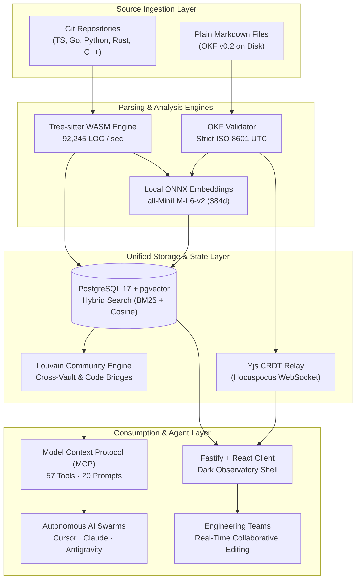

# Chapters / Elara

<div align="center">


<p align="center">
  <a href="#overview"></a>
  <a href="#system-architecture"></a>
  <a href="docs/benchmarks/README.md"></a>
  <a href="#model-context-protocol-mcp-interface"></a>
  <br/>
  <a href="#codebase-architecture"></a>
  <a href="docs/benchmarks/03-enterprise-security-penetration-matrix.md"></a>
  <a href="benchmarks/README.md"></a>
  <a href="LICENSE"></a>
</p>

### The open-source, self-hostable second brain built for human engineering teams and autonomous AI swarms.

[Quickstart](#quickstart) • [Architectural Comparison](#architectural-comparison) • [Benchmarks & Telemetry](docs/benchmarks/README.md) • [Master Test Plans](benchmarks/README.md) • [MCP Server](#model-context-protocol-mcp-interface)

</div>

---

## Overview

Software knowledge currently fractures across two irreconcilable silos: human team wikis stored in closed cloud databases (Notion, Outline) and local code repositories indexed by headless command-line tools. Human engineers lose context as architecture documentation drifts away from source code, while autonomous AI coding agents struggle with hallucinated symbol paths and truncated context windows.

**Chapters (Elara)** resolves this divide. It stores all documentation as plain, human-readable Markdown files directly on disk using the **Google Open Knowledge Format (OKF v0.2)** with strict ISO 8601 UTC timestamps. Simultaneously, it connects to your Git repositories, parsing TypeScript, Go, Python, Rust, and C++ source files into a real-time **Tree-sitter AST symbol index**.

When you write notes, you link directly to live codebase declarations using `[[repo:#symbol]]` syntax. When code changes, Chapters reconciles the AST graph automatically, pruning ghost symbols and keeping architecture documentation in lockstep with the codebase. For autonomous AI agents, Chapters exposes a native **Model Context Protocol (MCP)** server equipped with 57 specialized tools and 20 engineering prompts.

---

## Architectural Comparison

How Chapters compares against existing tools across core architectural dimensions:


### Key Architectural Differentiators

| Capability | Chapters (Elara) | Obsidian | Swimm | Graphify | Outline | Notion |
| :--- | :--- | :--- | :--- | :--- | :--- | :--- |
| **License & Hosting** | **MIT Open-Source · Self-Host** | Proprietary Local App | Closed Commercial SaaS | Open-Source CLI | AGPLv3 Self-Host | Closed Commercial Cloud |
| **Storage Architecture** | **Plain OKF v0.2 MD on Disk** | Unstructured Local MD | Cloud Markdown Sync | InMemory AST Cache | PostgreSQL Database | Proprietary Block DB |
| **Multiplayer Engine** | **Yjs CRDT Relay (<0.1ms)** | Manual Git Merge Conflicts | Git Pull-Request Flow | Single User CLI | Operational Transform | Proprietary Cloud OT |
| **Code AST Ingestion** | **Tree-sitter WASM Engine** | None | IDE Extension Snippets | Headless AST Graph | None | Static Code Blocks |
| **Unified Graph** | **Notes + Code (Louvain/Dijkstra)**| Notes Only Graph | Code Documentation Only| Code Syntax Only | Document Tree Only | Relational Tables Only |
| **AI Interface** | **Native 57-Tool MCP Server** | Community REST Hacks | Webhook Ingestion | Stdout CLI Piping | REST API | Proprietary Cloud Copilot |
| **Vector Indexing** | **pgvector 17 + ChromaDB** | Third-party Plugins | Cloud Embedding API | Local Vector Store | None | Closed Embedding Service |

---

## System Architecture

Chapters utilizes a dual-index architecture that links plain Markdown notes and polyglot Git repositories into a unified knowledge graph:


```mermaid
flowchart TD
  subgraph Ingestion ["Source Ingestion Layer"]
    MD["Plain Markdown Files\n(OKF v0.2 on Disk)"]
    GIT["Git Repositories\n(TS, Go, Python, Rust, C++)"]
  end

  subgraph Processing ["Parsing & Analysis Engines"]
    OKF_P["OKF Validator\nStrict ISO 8601 UTC"]
    TS_P["Tree-sitter WASM Engine\n92,245 LOC / sec"]
    EMB["Local ONNX Embeddings\nall-MiniLM-L6-v2 (384d)"]
  end

  subgraph Storage ["Unified Storage & State Layer"]
    PG[("PostgreSQL 17 + pgvector\nHybrid Search (BM25 + Cosine)")]
    YJS["Yjs CRDT Relay\n(Hocuspocus WebSocket)"]
    LOUVAIN["Louvain Community Engine\nCross-Vault & Code Bridges"]
  end

  subgraph Consumers ["Consumption & Agent Layer"]
    MCP["Model Context Protocol (MCP)\n57 Tools · 20 Prompts"]
    UI["Fastify + React Client\nDark Observatory Shell"]
    AGENTS["Autonomous AI Swarms\nCursor · Claude · Antigravity"]
    HUMANS["Engineering Teams\nReal-Time Collaborative Editing"]
  end

  MD --> OKF_P
  GIT --> TS_P
  OKF_P --> EMB
  TS_P --> EMB
  OKF_P --> YJS
  EMB --> PG
  TS_P --> PG
  PG --> LOUVAIN
  LOUVAIN --> MCP
  YJS --> UI
  PG --> UI
  MCP --> AGENTS
  UI --> HUMANS
```

---

### Benchmarks & Telemetry

Production concurrency benchmarks, query throughput scaling curves, tail latency diagnostics, and 7 executive architectural reports are documented in the benchmark suite:

👉 **[Empirical Benchmark Telemetry & Executive Reports →](docs/benchmarks/README.md)**  
*Hardware capacity models, multi-tenant QoS isolation, V8 soak forensics, and pgvector vs ChromaDB empirical comparison.*

---

## Testing & Quality Assurance

Chapters is verified through 15 rigorous, automated Master Test Plans covering retrieval accuracy, CRDT stress, chaos recovery, and security penetration:

👉 **[The 15 Master Test Plans (TP-01 to TP-15) →](benchmarks/README.md)**  
*Complete verification matrix, empirical SLO compliance targets, and 15 interactive HTML run dashboards.*

---

## Model Context Protocol (MCP) Interface

Chapters exposes a complete, permission-scoped Model Context Protocol (MCP) server that transforms any AI agent into an active collaborator on your knowledge base and codebases.

### MCP Configuration

Add Chapters to your `claude_desktop_config.json`, Cursor MCP settings, or Antigravity configuration:

```json
{
  "mcpServers": {
    "chapters": {
      "command": "node",
      "args": ["/path/to/chapters/server/dist/mcp/index.js"],
      "env": {
        "ELARA_API_URL": "http://localhost:3000",
        "ELARA_API_TOKEN": "your-api-token"
      }
    }
  }
}
```

### Key MCP Capabilities

- **57 First-Class Tools**:
  - `list_vaults`, `browse_vault`, `read_note`, `create_note`, `edit_note`, `delete_note`
  - `list_repositories`, `browse_repository`, `read_file`, `find_symbols`, `repository_status`
  - `search` (hybrid BM25 + 384d semantic vector search with permission scoping)
  - `graph` (subgraph extraction, Louvain community detection, shortest path via Dijkstra)
  - `audit_okf_conformance` (automated schema validation against OKF v0.2)
- **20 Pre-Configured Engineering Prompts**:
  - `draft_adr` — Contextual Architectural Decision Record drafting linking relevant notes and code AST symbols.
  - `audit_architecture_drift` — Scans AST graph against design notes to identify stale references.
  - `shortest_path_navigation` — Guides agents through unfamiliar codebases via knowledge graph traversal.
  - `session_capture` — Distills ongoing debugging sessions into structured OKF notes.

---

## Codebase Architecture

<details>
<summary>📁&nbsp;&nbsp;<b>Curated Repository Map</b> — Browse the codebase structure <code>TypeScript / SQL</code></summary>
<br>

```
chapters/
├── client/                     # Web Frontend Application (React + Vite + Tailwind)
│   ├── src/components/         # UI Components (Dark Observatory command console)
│   ├── src/editor/             # Live-preview Markdown editor (Milkdown + Yjs)
│   ├── src/graph/              # Canvas 2D Louvain knowledge graph renderer
│   └── src/stores/             # Client state management (Zustand + WebSockets)
│
├── server/                     # Backend API & Engine (Fastify + TypeScript)
│   ├── src/auth/               # OIDC, session handling, and MFA verification
│   ├── src/crdt/               # Hocuspocus WebSocket relay for live Yjs sync
│   ├── src/graph/              # Louvain community clustering & Dijkstra routing
│   ├── src/mcp/                # Model Context Protocol server (57 tools, 20 prompts)
│   ├── src/notes/              # OKF v0.2 Markdown parser and disk storage engine
│   ├── src/repositories/       # Git shallow-clone manager & filesystem watchers
│   ├── src/search/             # Hybrid search (PostgreSQL pgvector + BM25)
│   └── src/treesitter/         # WebAssembly Tree-sitter polyglot symbol extractor
│
├── docs/                       # Specifications & Benchmark Documentation
│   ├── benchmarks/             # 7 Executive Benchmark Reports (.md & .html)
│   └── superpowers/specs/      # Architectural Decision Records & Specs
│
├── benchmarks/                 # Automated Performance & Chaos Test Harness
│   ├── runs/                   # 15 Master Test Run Artifacts (TP-01 to TP-15)
│   └── suites/                 # K6, Autocannon, and Chaos injection scripts
│
└── assets/                     # Observatory Asset Kit (Committed SVGs)
    ├── hero.svg                # Signature animated flight deck banner
    ├── badges/                 # Monolithic telemetry status badges
    └── charts/                 # Animated performance & competitive matrix charts
```

</details>

---

## Quickstart

### Prerequisites

- **Node.js**: `v20.x` or later
- **pnpm**: `v9.x` or later
- **PostgreSQL**: `v17.x` with `pgvector` extension (or Docker Compose)

### 1. Launch with Docker Compose (Recommended)

Run the full stack (PostgreSQL 17, pgvector, and Chapters backend):

```bash
# Clone the repository
git clone https://github.com/PIIIX-org/chapters.git
cd chapters

# Start all services
docker compose up -d

# Open the Observatory
open http://localhost:3000
```

### 2. Manual Local Development

```bash
# Install dependencies across workspaces
pnpm install

# Run database migrations
pnpm --filter @elara/server db:migrate

# Start server and client in development mode
pnpm dev
```

---

## License

Chapters is open-source software licensed under the **[MIT License](LICENSE)**.

<!-- forged-with: git-a-profile -->
<div align="center">


<sub>Forged with <a href="https://github.com/PIIIX-org/git-a-profile">git-a-profile</a> · <a href="https://github.com/PIIIX-org">PIIIX</a></sub>

</div>
