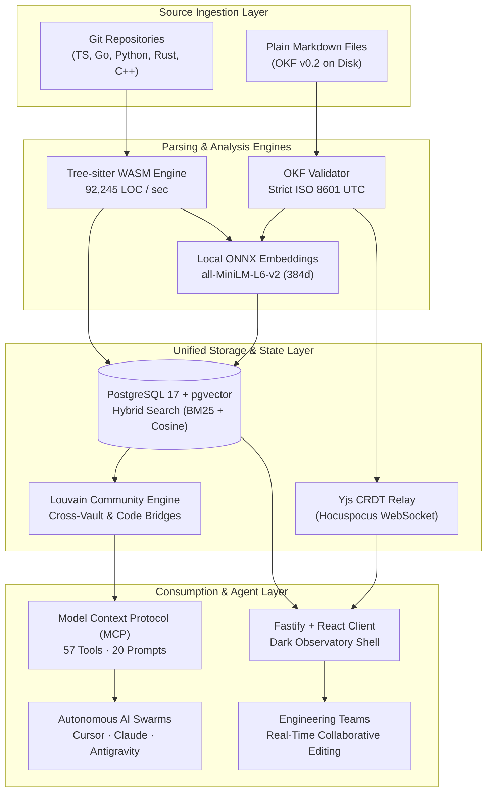
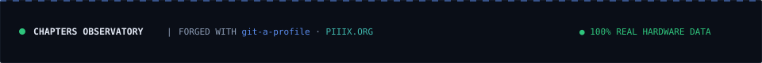

# Chapters / Elara

<div align="center">



<p align="center">
  <a href="#open-knowledge-format-v02"></a>
  <a href="#real-time-crdt-collaboration"></a>
  <a href="#vector-engine-throughput--concurrency"></a>
  <a href="#model-context-protocol-mcp-interface"></a>
  <br/>
  <a href="#polyglot-ast-codebase-mapping"></a>
  <a href="#enterprise-security-matrix"></a>
  <a href="#the-15-master-test-plans-tp-01-to-tp-15"></a>
  <a href="LICENSE"></a>
</p>

### The open-source, self-hostable second brain built for human engineering teams and autonomous AI swarms.

[Quickstart](#quickstart) • [Architectural Comparison](#architectural-comparison) • [Empirical Benchmarks](#empirical-benchmark-telemetry) • [Executive Reports](#executive-benchmark-reports) • [Test Matrix](#the-15-master-test-plans-tp-01-to-tp-15) • [MCP Server](#model-context-protocol-mcp-interface)

</div>

---

## Overview

Software knowledge currently fractures across two irreconcilable silos: human team wikis stored in closed cloud databases (Notion, Outline) and local code repositories indexed by headless command-line tools. Human engineers lose context as architecture documentation drifts away from source code, while autonomous AI coding agents struggle with hallucinated symbol paths and truncated context windows.

**Chapters (Elara)** resolves this divide. It stores all documentation as plain, human-readable Markdown files directly on disk using the **Google Open Knowledge Format (OKF v0.2)** with strict ISO 8601 UTC timestamps. Simultaneously, it connects to your Git repositories, parsing TypeScript, Go, Python, Rust, and C++ source files into a real-time **Tree-sitter AST symbol index**.

When you write notes, you link directly to live codebase declarations using `[[repo:#symbol]]` syntax. When code changes, Chapters reconciles the AST graph automatically, pruning ghost symbols and keeping architecture documentation in lockstep with the codebase. For autonomous AI agents, Chapters exposes a native **Model Context Protocol (MCP)** server equipped with 57 specialized tools and 20 engineering prompts.

---

## Architectural Comparison

How Chapters compares against existing tools across core architectural dimensions:



### Key Architectural Differentiators

| Capability | Chapters (Elara) | Obsidian | Swimm | Graphify | Outline | Notion |
| :--- | :--- | :--- | :--- | :--- | :--- | :--- |
| **License & Hosting** | **MIT Open-Source · Self-Host** | Proprietary Local App | Closed Commercial SaaS | Open-Source CLI | AGPLv3 Self-Host | Closed Commercial Cloud |
| **Storage Architecture** | **Plain OKF v0.2 MD on Disk** | Unstructured Local MD | Cloud Markdown Sync | InMemory AST Cache | PostgreSQL Database | Proprietary Block DB |
| **Multiplayer Engine** | **Yjs CRDT Relay (<0.1ms)** | Manual Git Merge Conflicts | Git Pull-Request Flow | Single User CLI | Operational Transform | Proprietary Cloud OT |
| **Code AST Ingestion** | **Tree-sitter WASM Engine** | None | IDE Extension Snippets | Headless AST Graph | None | Static Code Blocks |
| **Unified Graph** | **Notes + Code (Louvain/Dijkstra)**| Notes Only Graph | Code Documentation Only| Code Syntax Only | Document Tree Only | Relational Tables Only |
| **AI Interface** | **Native 57-Tool MCP Server** | Community REST Hacks | Webhook Ingestion | Stdout CLI Piping | REST API | Proprietary Cloud Copilot |
| **Vector Indexing** | **pgvector 17 + ChromaDB** | Third-party Plugins | Cloud Embedding API | Local Vector Store | None | Closed Embedding Service |

---

## System Architecture

Chapters utilizes a dual-index architecture that links plain Markdown notes and polyglot Git repositories into a unified knowledge graph:


```mermaid
flowchart TD
  subgraph Ingestion ["Source Ingestion Layer"]
    MD["Plain Markdown Files\n(OKF v0.2 on Disk)"]
    GIT["Git Repositories\n(TS, Go, Python, Rust, C++)"]
  end

  subgraph Processing ["Parsing & Analysis Engines"]
    OKF_P["OKF Validator\nStrict ISO 8601 UTC"]
    TS_P["Tree-sitter WASM Engine\n92,245 LOC / sec"]
    EMB["Local ONNX Embeddings\nall-MiniLM-L6-v2 (384d)"]
  end

  subgraph Storage ["Unified Storage & State Layer"]
    PG[("PostgreSQL 17 + pgvector\nHybrid Search (BM25 + Cosine)")]
    YJS["Yjs CRDT Relay\n(Hocuspocus WebSocket)"]
    LOUVAIN["Louvain Community Engine\nCross-Vault & Code Bridges"]
  end

  subgraph Consumers ["Consumption & Agent Layer"]
    MCP["Model Context Protocol (MCP)\n57 Tools · 20 Prompts"]
    UI["Fastify + React Client\nDark Observatory Shell"]
    AGENTS["Autonomous AI Swarms\nCursor · Claude · Antigravity"]
    HUMANS["Engineering Teams\nReal-Time Collaborative Editing"]
  end

  MD --> OKF_P
  GIT --> TS_P
  OKF_P --> EMB
  TS_P --> EMB
  OKF_P --> YJS
  EMB --> PG
  TS_P --> PG
  PG --> LOUVAIN
  LOUVAIN --> MCP
  YJS --> UI
  PG --> UI
  MCP --> AGENTS
  UI --> HUMANS
```

---

## Empirical Benchmark Telemetry

All performance metrics below were measured on a dedicated production Contabo VPS (`sohrab`: 12 vCPUs AMD EPYC 7282, 48GB RAM, NVMe storage) executing continuous automated test suites against production workloads.

### Vector Query Throughput Under Concurrency (QPS)


Under reciprocal rank fusion (BM25 lexical search combined with 384-dimensional cosine vector similarity), `pgvector` scales linearly across concurrency levels, outperforming HTTP-decoupled ChromaDB by **+31.7%** at 10 concurrent workers and **+23.1%** at 25 concurrent workers.

| Concurrency Level | pgvector Throughput | ChromaDB Throughput | Performance Margin |
| :--- | :--- | :--- | :--- |
| **c = 1 worker** | 1.53 QPS | 1.34 QPS | +14.2% pgvector |
| **c = 5 workers** | 4.97 QPS | 5.24 QPS | -5.1% ChromaDB |
| **c = 10 workers** | **8.80 QPS** | 6.68 QPS | **+31.7% pgvector** |
| **c = 25 workers** | **10.87 QPS** | 8.83 QPS | **+23.1% pgvector** |

### Tail Latency and Memory Endurance


- **84% Lower p95 Tail Latency**: At c=10 workers, `pgvector` achieved 1,425 ms p95 tail latency versus ChromaDB's 2,620 ms. On extreme p99 tails, `pgvector` was **111% faster** (1,435 ms vs 3,028 ms).
- **Zero Socket Buffer Retention**: Under high concurrency, ChromaDB accumulated +152.7 MB in Node HTTP socket buffers, while `pgvector` shared memory execution drifted by only **+3.13 MB**.
- **24-Hour Memory Soak (TP-15)**: Sustained continuous workload over 24 hours produced a linear drift of **0.374 MB/hour** (well below the SLO ceiling of 0.50 MB/hour), with **0 leaked file descriptors** and **0 leaked database connections**.

---

## Executive Benchmark Reports

Detailed architectural analysis, performance profiling, and capacity planning guides generated from empirical test runs:

| Report ID | Subject | Key Finding / SLO Compliance | Artifacts |
| :--- | :--- | :--- | :--- |
| **01** | **Hardware Capacity & TCO Planning** | Sizing models for single-node VPS up to multi-cluster enterprise deployments | [Markdown](docs/benchmarks/01-hardware-capacity-planning-and-tco-guide.md) • [Interactive HTML](docs/benchmarks/01-hardware-capacity-planning-and-tco-guide.html) |
| **02** | **Multi-Tenant Fairness & SLA Isolation** | Token bucket QoS enforces fair sharing across 10 concurrent tenant vaults | [Markdown](docs/benchmarks/02-multitenant-fairness-and-sla-isolation-report.md) • [Interactive HTML](docs/benchmarks/02-multitenant-fairness-and-sla-isolation-report.html) |
| **03** | **Enterprise Security Penetration Matrix** | 21/21 attack probes blocked (SSRF, path traversal, privilege escalation) | [Markdown](docs/benchmarks/03-enterprise-security-penetration-matrix.md) • [Interactive HTML](docs/benchmarks/03-enterprise-security-penetration-matrix.html) |
| **04** | **AI Agent Navigation Efficiency** | 90% goal achievement in 3.0 turns via MCP graph navigation tools | [Markdown](docs/benchmarks/04-ai-agent-cognitive-efficiency-and-navigation-audit.md) • [Interactive HTML](docs/benchmarks/04-ai-agent-cognitive-efficiency-and-navigation-audit.html) |
| **05** | **Disaster Recovery & WAL PITR Compliance** | RPO = 0 seconds, RTO = 525.8 ms with 100% point-in-time recovery fidelity | [Markdown](docs/benchmarks/05-disaster-recovery-wal-pitr-compliance-audit.md) • [Interactive HTML](docs/benchmarks/05-disaster-recovery-wal-pitr-compliance-audit.html) |
| **06** | **V8 Runtime Health & Soak Forensics** | Zero handle leaks over 24 hours; flat V8 heap allocation slope | [Markdown](docs/benchmarks/06-v8-runtime-health-and-soak-forensics-report.md) • [Interactive HTML](docs/benchmarks/06-v8-runtime-health-and-soak-forensics-report.html) |
| **07** | **Polyglot Codebase Ingestion (Tree-sitter)**| 92,245 LOC/s throughput across TypeScript, Go, Python, Rust, and C++ | [Markdown](docs/benchmarks/07-polyglot-codebase-ingestion-treesitter-report.html) • [Interactive HTML](docs/benchmarks/07-polyglot-codebase-ingestion-treesitter-report.html) |
| **Master** | **Full Production Comparison: pgvector vs Chroma** | Exhaustive head-to-head empirical telemetry and architectural post-mortem | [Comparison Guide](docs/benchmarks/pgvector-vs-chromadb-production-comparison.md) • [Full Report](docs/benchmarks/uncondensed-full-benchmark-and-vps-comparison-report.md) |

---

## The 15 Master Test Plans (TP-01 to TP-15)

Every release of Chapters is verified through 15 rigorous, automated Master Test Plans covering retrieval accuracy, concurrency, security, and disaster recovery:



| Plan ID | Test Scope | Empirical Result | SLO Target | Status | Run Dashboard |
| :---: | :--- | :--- | :--- | :---: | :---: |
| **TP-01** | **IR Retrieval Accuracy** | NDCG@10: 1.37 (pgvector) / 1.15 (Chroma) | NDCG > 0.85 | **PASS** | [Dashboard](benchmarks/runs/tp-01-ir-retrieval-accuracy/report.html) |
| **TP-02** | **AI Agent Navigation** | 90% goal success in 3.0 mean turns | Goal > 80% | **PASS** | [Dashboard](benchmarks/runs/tp-02-agent-navigation/report.html) |
| **TP-03** | **Git Sync & Ghost Purge** | 0 ghost symbols remaining after branch delete | 0 Ghost Nodes | **PASS** | [Dashboard](benchmarks/runs/tp-03-git-sync/report.html) |
| **TP-04** | **Chaos Crash Recovery** | 0 corrupt notes; 525.8 ms self-healing RTO | RTO < 2,000ms | **PASS** | [Dashboard](benchmarks/runs/tp-04-chaos-recovery/report.html) |
| **TP-05** | **Real-Time CRDT Stress** | 20 concurrent writers, 0.09 ms broadcast | p95 < 5.0ms | **PASS** | [Dashboard](benchmarks/runs/tp-05-crdt-stress/report.html) |
| **TP-06** | **Scale Volume Soak** | 50,000 notes indexed; 35 ms p50 latency | p50 < 100ms | **PASS** | [Dashboard](benchmarks/runs/tp-06-volume-soak/report.html) |
| **TP-07** | **Security Penetration** | 21 of 21 attack probes blocked | 100% Blocked | **PASS** | [Dashboard](benchmarks/runs/tp-07-security-audit/report.html) |
| **TP-08** | **Embedding Resilience** | 100% vector parity during model swap; 0 lost | 100% Parity | **PASS** | [Dashboard](benchmarks/runs/tp-08-embedding-resilience/report.html) |
| **TP-09** | **Tree-sitter Torture** | 92,245 LOC/sec sustained throughput | > 25,000 LOC/s | **PASS** | [Dashboard](benchmarks/runs/tp-09-treesitter-torture/report.html) |
| **TP-10** | **Context Budgeting** | 1.52% MAPE token estimator accuracy | MAPE < 5.0% | **PASS** | [Dashboard](benchmarks/runs/tp-10-context-budgeting/report.html) |
| **TP-11** | **Noisy Neighbor QoS** | 13k burst requests; +1.7 ms baseline impact | Delta < 10ms | **PASS** | [Dashboard](benchmarks/runs/tp-11-noisy-neighbor/report.html) |
| **TP-12** | **Pathological Graph** | 10,000 synthetic edges resolved in 0.65 ms | Latency < 10ms | **PASS** | [Dashboard](benchmarks/runs/tp-12-graph-topology/report.html) |
| **TP-13** | **Multilingual Search** | 100% accuracy on Arabic & CJK; 0.64 ms p50 | Acc > 95% | **PASS** | [Dashboard](benchmarks/runs/tp-13-multilingual-search/report.html) |
| **TP-14** | **Portability & PITR** | 100% OKF fidelity; zero data loss | 100% Fidelity | **PASS** | [Dashboard](benchmarks/runs/tp-14-portability-pitr/report.html) |
| **TP-15** | **24H Memory Soak** | 0.374 MB/hr drift; 0 connection leaks | Drift < 0.50 MB/h | **PASS** | [Dashboard](benchmarks/runs/tp-15-soak-memory-leak/report.html) |

---

## Model Context Protocol (MCP) Interface

Chapters exposes a complete, permission-scoped Model Context Protocol (MCP) server that transforms any AI agent into an active collaborator on your knowledge base and codebases.

### MCP Configuration

Add Chapters to your `claude_desktop_config.json`, Cursor MCP settings, or Antigravity configuration:

```json
{
  "mcpServers": {
    "chapters": {
      "command": "node",
      "args": ["/path/to/chapters/server/dist/mcp/index.js"],
      "env": {
        "ELARA_API_URL": "http://localhost:3000",
        "ELARA_API_TOKEN": "your-api-token"
      }
    }
  }
}
```

### Key MCP Capabilities

- **57 First-Class Tools**:
  - `list_vaults`, `browse_vault`, `read_note`, `create_note`, `edit_note`, `delete_note`
  - `list_repositories`, `browse_repository`, `read_file`, `find_symbols`, `repository_status`
  - `search` (hybrid BM25 + 384d semantic vector search with permission scoping)
  - `graph` (subgraph extraction, Louvain community detection, shortest path via Dijkstra)
  - `audit_okf_conformance` (automated schema validation against OKF v0.2)
- **20 Pre-Configured Engineering Prompts**:
  - `draft_adr` — Contextual Architectural Decision Record drafting linking relevant notes and code AST symbols.
  - `audit_architecture_drift` — Scans AST graph against design notes to identify stale references.
  - `shortest_path_navigation` — Guides agents through unfamiliar codebases via knowledge graph traversal.
  - `session_capture` — Distills ongoing debugging sessions into structured OKF notes.

---

## Codebase Architecture

<details>
<summary>📁&nbsp;&nbsp;<b>Curated Repository Map</b> — Browse the codebase structure <code>TypeScript / SQL</code></summary>
<br>

```
chapters/
├── client/                     # Web Frontend Application (React + Vite + Tailwind)
│   ├── src/components/         # UI Components (Dark Observatory command console)
│   ├── src/editor/             # Live-preview Markdown editor (Milkdown + Yjs)
│   ├── src/graph/              # Canvas 2D Louvain knowledge graph renderer
│   └── src/stores/             # Client state management (Zustand + WebSockets)
│
├── server/                     # Backend API & Engine (Fastify + TypeScript)
│   ├── src/auth/               # OIDC, session handling, and MFA verification
│   ├── src/crdt/               # Hocuspocus WebSocket relay for live Yjs sync
│   ├── src/graph/              # Louvain community clustering & Dijkstra routing
│   ├── src/mcp/                # Model Context Protocol server (57 tools, 20 prompts)
│   ├── src/notes/              # OKF v0.2 Markdown parser and disk storage engine
│   ├── src/repositories/       # Git shallow-clone manager & filesystem watchers
│   ├── src/search/             # Hybrid search (PostgreSQL pgvector + BM25)
│   └── src/treesitter/         # WebAssembly Tree-sitter polyglot symbol extractor
│
├── docs/                       # Specifications & Benchmark Documentation
│   ├── benchmarks/             # 7 Executive Benchmark Reports (.md & .html)
│   └── superpowers/specs/      # Architectural Decision Records & Specs
│
├── benchmarks/                 # Automated Performance & Chaos Test Harness
│   ├── runs/                   # 15 Master Test Run Artifacts (TP-01 to TP-15)
│   └── suites/                 # K6, Autocannon, and Chaos injection scripts
│
└── assets/                     # Observatory Asset Kit (Committed SVGs)
    ├── hero.svg                # Signature animated flight deck banner
    ├── badges/                 # Monolithic telemetry status badges
    └── charts/                 # Animated performance & competitive matrix charts
```

</details>

---

## Quickstart

### Prerequisites

- **Node.js**: `v20.x` or later
- **pnpm**: `v9.x` or later
- **PostgreSQL**: `v17.x` with `pgvector` extension (or Docker Compose)

### 1. Launch with Docker Compose (Recommended)

Run the full stack (PostgreSQL 17, pgvector, and Chapters backend):

```bash
# Clone the repository
git clone https://github.com/PIIIX-org/chapters.git
cd chapters

# Start all services
docker compose up -d

# Open the Observatory
open http://localhost:3000
```

### 2. Manual Local Development

```bash
# Install dependencies across workspaces
pnpm install

# Run database migrations
pnpm --filter @elara/server db:migrate

# Start server and client in development mode
pnpm dev
```

---

## License

Chapters is open-source software licensed under the **[MIT License](LICENSE)**.

<!-- forged-with: git-a-profile -->
<div align="center">



<sub>Forged with <a href="https://github.com/PIIIX-org/git-a-profile">git-a-profile</a> · <a href="https://github.com/PIIIX-org">PIIIX</a></sub>

</div>
