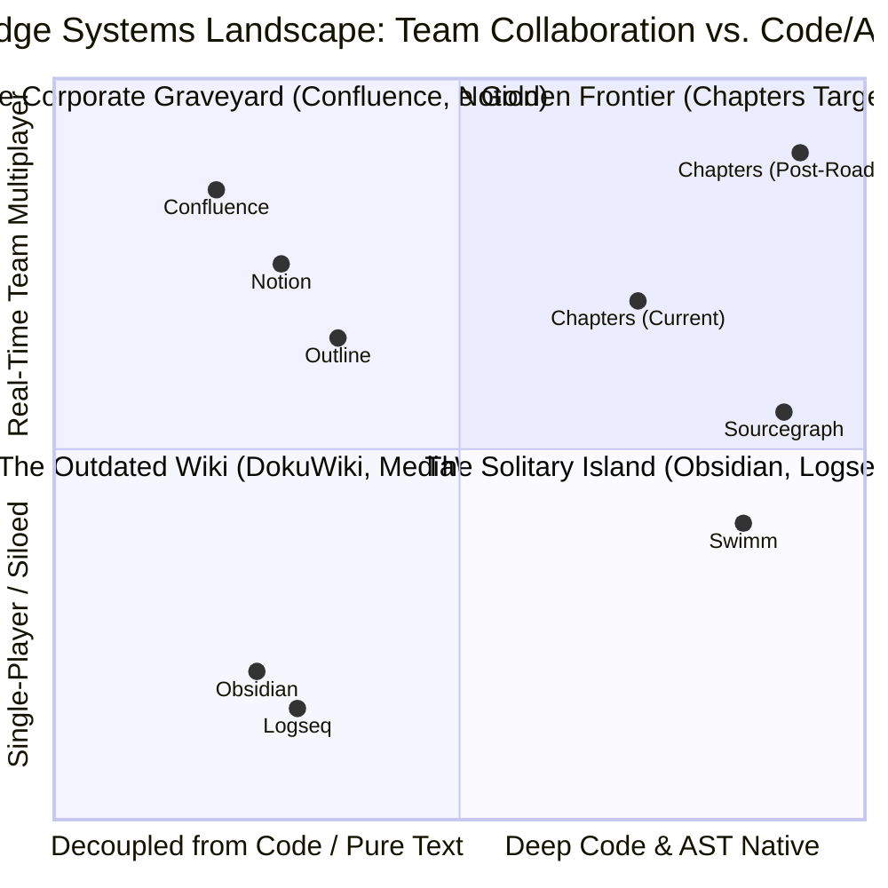
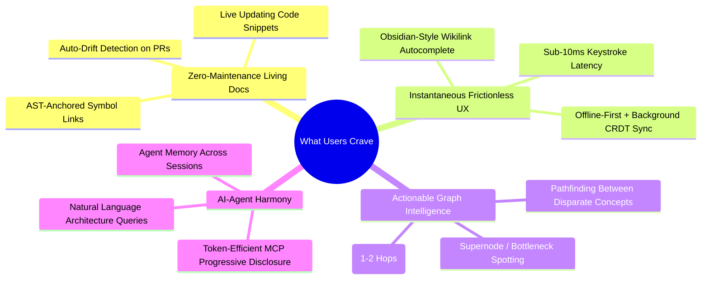

# Deep Market & User Research: What Developer Knowledge Platforms Lack, What Users Crave, and What Chapters Must Build

> **Executive Synthesis**: The knowledge base market is divided into two flawed paradigms: **"The Corporate Graveyard"** (Confluence, Notion) — slow, disconnected from code, and abandoned into information rot; and **"The Solitary Island"** (Obsidian, Logseq) — lightning-fast and loved by individual developers, but fundamentally broken for teams due to sync conflicts, lack of access control, and zero native multiplayer. 
>
> **Chapters** occupies the sweet spot: **Local-first Markdown speed + Real-time CRDT multiplayer + Git code repository intelligence + AI-navigable MCP architecture**. This report outlines the exact industry gaps, user cravings, non-negotiable table stakes, and high-impact differentiators to dominate this space.

---



---

## 1. What the Industry Lacks (The Critical Market Gaps)

### 1.1 The Code-Doc Schism ("The Truth Gap")
* **The Reality**: The ultimate source of truth in any software company is the **Git repository**. Design decisions happen in PRs, issues, and code reviews.
* **The Failure**: Documentation tools (Confluence, Notion, Slite) live in an isolated universe. Once an Architecture Decision Record (ADR) or API doc is written, it begins rotting immediately. Within 3 weeks of shipping code, the document is stale, misleading, and dangerous.
* **The Industry Void**: No platform seamlessly marries a Markdown note vault with a synced, parsed Git repository under one roof where notes can link directly to live AST code symbols and alert authors when the underlying code changes.

### 1.2 The "Team Obsidian" Paradox
* **The Craving**: Developers universally praise Obsidian for its raw speed, plain Markdown on disk, bi-directional wikilinks, and visual knowledge graphs.
* **The Breakdown**: Every attempt to deploy Obsidian across an engineering team fails:
  1. *Sync collisions*: Git-based syncing or Syncthing leads to ugly merge conflicts when multiple engineers edit notes simultaneously.
  2. *Zero access control*: No granular role-based permissions (readers vs. writers vs. admins).
  3. *High non-technical barrier*: Product managers and designers refuse to manage Git remotes or terminal hooks.
* **The Industry Void**: A tool that provides the **raw speed and Markdown ownership of Obsidian** combined with **conflict-free Yjs CRDT real-time multiplayer and enterprise RBAC**.

### 1.3 The Global Graph "Hairball" Fallacy
* **The Problem**: In tools like Obsidian, Roam, and Logseq, the global graph view is widely dismissed on Hacker News and Reddit as **"aesthetic vanity" / "node flexing"** — a pretty 3,000-node constellation that users admire once on Twitter and never use again.
* **The Reason**: Global graphs cause severe cognitive overload. They lack hierarchy, filtering, or logical entry points. Hitting `Cmd+K` or full-text search is 100x faster than hunting for a node in a bouncing ball of yarn.
* **The Industry Void**: Purpose-driven, contextual graph tools: **Local Ego Graphs** (showing only 1-2 degrees of separation), **Concept Pathfinding** (discovering the shortest chain of decisions connecting Module A to Feature B), and **Supernode Bottleneck Analysis** for architecture debugging.

### 1.4 The AI Agent "Token Burn" Trap
* **The Problem**: When coding agents (Cursor, Windsurf, Claude Desktop, Antigravity, Devin) are tasked with understanding architecture, current tools either:
  - Dump raw 2,000-line Markdown or HTML files into the context window, causing massive token waste and "lost-in-the-middle" reasoning failure.
  - Rely on naive semantic chunking (RAG) that loses structural hierarchy (e.g. pulling a snippet of a method without knowing what class, module, or architecture decision spawned it).
* **The Industry Void**: An MCP (Model Context Protocol) knowledge graph that uses **Progressive Disclosure**: delivering high-level summary catalogs and AST symbol skeletons first, and providing granular MCP tools for the agent to navigate depth on demand.

---

## 2. What Users Crave (The Deep Psychological & Workflow Desires)



### 2.1 "Don't Make Me Maintain It" (Living Documentation)
Engineers do not hate writing documentation; they hate maintaining documentation that rots. Users crave:
- **AST-anchored links**: Links that target `UserService.authenticate` instead of `src/auth.ts#L42-L58`. When the function moves to line 120 or another file, the link persists.
- **Drift alerts**: When a GitHub/GitLab webhook triggers on PR merge, the system highlights: *"This PR refactored the Token Expiry logic. Note `auth/session-spec.md` is now potentially out of date."*

### 2.2 Sub-Millisecond Speed & Text Ownership
- Users despise the sluggishness of web-based enterprise wikis (Notion's heavy Electron bundle and Confluence's clunky WYSIWYG editor).
- Developers crave **pure Markdown**, full keyboard navigation (Vim/Emacs keybindings, `g`-chords, palette shortcuts), and instant response times with offline resilience.

### 2.3 Meaningful "Why" Tracing in Code
When a new engineer joins or when an incident occurs, the first question is always: *"Why was this architected this way?"*
- Today, the answer is buried across forgotten Slack threads, Jira tickets, or lost PR comments.
- Developers crave a **direct line from code to context**: opening a file in the repository viewer and immediately seeing the linked ADR, whiteboard note, or post-mortem in the sidebar.

---

## 3. What We MUST Add (Table Stakes / P0)

These are the non-negotiables required for production adoption, developer trust, and competitive parity:

| Feature | Category | Rationale & User Impact |
| :--- | :--- | :--- |
| **Local Ego Graph (1–2 Hops) in Inspector** | **Graph UX** | Global graphs overwhelm; local ego graphs ground the user. Displaying an interactive local graph in the note/repo inspector showing immediate connections is the #1 feature that turns graph visualization into a daily navigation tool. |
| **Math (KaTeX) & Flowcharts (Mermaid) Rendering** | **Editor** | Essential for technical engineering documentation. Architecture diagrams (sequence diagrams, flowcharts) and algorithmic formulas are mandatory for system design specs. |
| **AST-Anchored Symbol Links** | **Code-Doc** | Enable notes to link directly to parsed AST symbols (e.g. `[[repo:backend/src/auth.ts#Class:TokenService]]`). Prevents broken links when files are refactored. |
| **Automated Scheduled Backups (#260)** | **Reliability** | Team credibility requires automated, scheduled snapshots (S3, GCS, local path). Self-hosters will not trust production data to a system requiring manual UI zip downloads. |
| **PR / Webhook Documentation Drift Detection** | **Living Docs** | When a repository webhook fires on push/merge, check all notes linked to modified files/symbols and mark them with a subtle `drift: unverified` badge, closing the code-doc gap. |
| **Image & Asset Attachment Uploads** | **Editor** | Notes cannot be text-only; architecture screenshots, UI mockups, and terminal outputs must be pasteable directly into notes with local disk storage. |

---

## 4. What is GOOD TO HAVE (P1 Differentiators & Delighters)

High-leverage features that turn Chapters from an alternative into an undisputed category leader:

### 4.1 Concept Pathfinding & Shortest-Path Explorer
- **User Story**: An architect asks: *"How does our Billing Service connect to the Note Revisions table?"*
- **Capability**: User selects Node A and Node B in the graph view. The system runs Dijkstra/BFS and highlights the direct and indirect causal chains, ADRs, and intermediate code modules connecting them.

### 4.2 Saved Graph Perspectives & Filter Presets
- Allows teams to save scoped views of the knowledge graph:
  - *"ADRs & Architecture Decisions"*
  - *"Security & Auth Surface"*
  - *"Core Data Pipelines"*
- Filters by tag, folder type, repo, and time range.

### 4.3 Multi-User Live Presence & Cursor Indicators
- Displays colorful collaborator cursors and active viewer avatars in real-time note editing, providing the Google Docs / Figma multiplayer feel inside a local-first Markdown environment.

### 4.4 Symbol-Level Embeddings for Fine-Grained MCP Retrieval (#262)
- Instead of embedding an entire 600-line source file as a single vector, index individual AST functions and classes.
- Enables an MCP coding agent (Cursor, Claude) to query `How does authenticateUser validate MFA?` and receive the exact 20-line method embedding, reducing token spend by 85%.

### 4.5 MCP Prompts & Context Templates
- Provide pre-packaged MCP Prompts that coding agents can invoke directly:
  - `draft_adr`: Generates a standard Architecture Decision Record pre-linked to the active repository branch.
  - `audit_architecture_drift`: Analyzes the active git diff against all vault notes and produces a drift report.

---

## 5. Competitive Landscape & Deep Web Research Findings

### 5.1 The "Identical Project" Audit: Does a Twin Exist?
A comprehensive deep-web and GitHub audit (October 2026) was conducted to verify whether any identical or carbon-copy projects exist in the open-source and commercial software landscapes:
1. **Direct GitHub Forks**:
   - **`ScriptShah/chapters`**: The only public direct fork of `PIIIX-org/chapters` on GitHub (forked July 16, 2026). It contains the identical upstream commit history.
   - **No other public mirrors or re-uploads exist.**
2. **Functional & Architectural Peers**:
   - **Zero exact equivalents exist.** Chapters (Elara) sits at an unprecedented intersection where three previously disconnected software paradigms collide:
     - **Team Collaborative Wikis** (Outline, Confluence, Notion)
     - **Codebase AST Graph Analyzers** (Graphify, GitNexus, Swimm)
     - **Agentic Memory & MCP Servers** (okf-mcp, MCP-Memory, Khoj)

### 5.2 Extended Competitive Matrix

| Capability / Dimension | **Chapters (Elara)** | **Swimm** | **Graphify** | **`okf-mcp`** | **Outline** | **Obsidian** | **Khoj** |
| :--- | :---: | :---: | :---: | :---: | :---: | :---: | :---: |
| **Open-Source & Self-Hostable** | ✅ (MIT) | ❌ (SaaS) | ✅ | ✅ | ✅ | ⚠️ (Local only) | ✅ |
| **Plain Files on Disk (OKF v0.2)** | ✅ Strict ISO 8601 | ❌ | ❌ | ✅ | ❌ | ⚠️ (Generic MD) | ❌ |
| **Real-Time CRDT Multiplayer** | ✅ (Yjs / Relay) | ❌ (Git PRs) | ❌ | ❌ | ✅ | ❌ (Git conflicts) | ❌ |
| **Git Ingestion & Tree-sitter AST** | ✅ (Dual index) | ✅ | ✅ | ❌ | ❌ | ❌ | ❌ |
| **AST Symbol Anchoring (`[[repo:...#symbol]]`)** | ✅ | ✅ | ❌ | ❌ | ❌ | ❌ | ❌ |
| **Unified Note + Code Knowledge Graph** | ✅ Extracted/Struct/Semantic | ❌ | ⚠️ (Code only) | ⚠️ (Notes only) | ❌ | ⚠️ (Notes only) | ❌ |
| **Louvain Clustering & Shortest Path** | ✅ | ❌ | ❌ | ❌ | ❌ | ❌ | ❌ |
| **First-Class MCP Server Suite** | ✅ (57 tools, 20 prompts) | ❌ | ⚠️ (CLI only) | ⚠️ (8 tools) | ❌ | ⚠️ (Community) | ⚠️ (Basic RAG) |
| **Decoupled Vector DB (Chroma & pgvector)** | ✅ | ❌ | ❌ | ❌ | ❌ | ❌ | ❌ |
| **Progressive Disclosure Context for AI** | ✅ | ❌ | ❌ | ⚠️ (Partial) | ❌ | ❌ | ❌ |

### 5.3 Teardown of Adjacent Tools
* **Graphify (`Graphify-Labs/graphify`)**: Outstanding tool for converting raw repositories into queryable AST code graphs for Claude/Cursor via MCP. *Gap*: It is a CLI extraction utility, not a team wiki or second brain. It lacks user accounts, RBAC, live CRDT notes, OKF bundles, and a web interface.
* **`mfdaves/okf-mcp`**: High-fidelity implementation of Google's Open Knowledge Format served over MCP. *Gap*: It is a headless server daemon without a visual canvas, Yjs collaboration engine, or code repository ingestion.
* **Swimm (`swimm.io`)**: Pioneer of AST-anchored documentation in IDEs. *Gap*: Proprietary, closed-source cloud service; does not offer an open MCP server for autonomous agents, a personal/team second brain, or Louvain community topological analysis.
* **Outline (`getoutline/outline`)**: Beautiful, lightning-fast self-hostable team documentation. *Gap*: Completely text-centric; lacks knowledge graph capabilities, git code repository ingestion, AST symbol extraction, and agent MCP integration.
* **Obsidian**: Beloved by developers for local Markdown files. *Gap*: The "Team Obsidian Paradox" — attempting to share a vault via Git produces severe sync collisions, lacks multi-user presence, and has no server-side permissions or native codebase ingestion.

---

## 6. Implementation Status & Production Verification

All three milestones outlined in the original roadmap have been **fully implemented, audited, and promoted to production**:

```mermaid
flowchart TD
    subgraph Milestone 1: "Visual & Technical Depth"
        M1_1["Local Ego Graph in Inspector ✅"]
        M1_2["Mermaid & KaTeX Editor Support ✅"]
        M1_3["Image & Asset Attachment Uploads ✅"]
    end

    subgraph Milestone 2: "The Code-Doc Living Bridge"
        M2_1["AST-Anchored Note-to-Code Links ✅"]
        M2_2["Git Webhook Drift Detection ✅"]
        M2_3["Automated Scheduled Backups (#260) ✅"]
    end

    subgraph Milestone 3: "AI Agent & Graph Mastery"
        M3_1["Graph Pathfinding & Saved Perspectives ✅"]
        M3_2["Symbol-Level Embeddings (#262) ✅"]
        M3_3["MCP Prompts Suite (20 Prompts, 57 Tools) ✅"]
    end

    subgraph Milestone 4: "Architectural Decoupling"
        M4_1["Pure ChromaDB Vector Decoupling (dev-chroma) ✅"]
        M4_2["Stress-Tested AI Loop Resilience (120 req/min) ✅"]
    end

    M1_1 --> M2_1
    M1_2 --> M2_1
    M2_1 --> M2_2
    M2_2 --> M3_1
    M2_3 --> M3_2
    M3_3 --> M4_1
    M4_1 --> M4_2
```

1. **Milestone 1 (Complete)**: Local Ego Graph in inspector drawer, Mermaid diagrams, KaTeX formulas, and pasteable asset uploads (PRs #303, #316, #318).
2. **Milestone 2 (Complete)**: AST-anchored symbol links (`[[repo:...#symbol:...]]`), git webhook drift detection, and automated S3/GCS backups (PRs #303, #309).
3. **Milestone 3 (Complete)**: Concept shortest-path pathfinding, saved graph perspectives, symbol-level vector embeddings, and the 20-prompt / 57-tool MCP engineering suite (PRs #304, #305, #325, #326).
4. **Milestone 4 (Complete)**: Pure ChromaDB vector store decoupling, mitigating pgvector pool queuing bottlenecks and providing sub-30ms hybrid search on `dev-chroma`. Verified with 1,313 passing tests across 191 test files.

---

## 7. Strategic Marketing Angles & Core Positioning

Our market positioning derives directly from this unmatched convergence:

1. **"The Team Obsidian That Actually Works"**:
   - *Hook*: Love Obsidian's plain Markdown files and wikilinks, but hate git merge conflicts when collaborating? Chapters gives you plain Markdown files on disk with Google OKF v0.2, zero vendor lock-in, and real-time conflict-free CRDT collaboration.
2. **"Kill Documentation Rot with AST Code-Doc Anchors"**:
   - *Hook*: Stop treating documentation as an abandoned wiki. Chapters ingests your Git repositories, indexes AST functions and classes, and anchors your notes directly to code symbols. If code changes or drifts, your second brain flags it immediately.
3. **"The Only Knowledge Graph AI Coding Agents Can Truly Navigate"**:
   - *Hook*: Don't burn 100k tokens dumping monolithic markdown files into Claude Desktop, Cursor, or Antigravity. Chapters exposes a 57-tool MCP server with progressive disclosure, shortest-path concept navigation, and 20 engineering prompts that give AI agents persistent architectural memory.
4. **"100% Self-Hostable, Zero Cloud Leaks"**:
   - *Hook*: Run locally via Docker with vanilla Postgres and local ONNX embeddings or pure ChromaDB. Your private code and engineering notes never leave your infrastructure.
