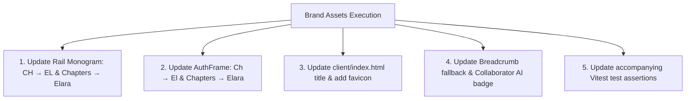

# Phase 1: Brand Assets Identification & Execution Plan

**Date**: 2026-10-03  
**Scope**: Exact identification of all brand assets across the Chapters platform, their precise UI usage locations, and the zero-color-change transition specification to **Elara**.  
**Related Vault Notes**: `rebranding/phase-1-brand-assets-plan`, `rebranding/blueprint-overall-plan`, `spec/2026-10-03-chapters-to-elara-rebrand-master-plan`.  

---

> [!IMPORTANT]
> **Core Constraints Mandated by User**:
> 1. **Zero Color / Palette Changes**: All colors remain strictly identical (deep space obsidian `#070A0F` / `#0B0F17`, hairline borders `var(--border)`, emerald accent `var(--primary)`, typography stacks `Geist` / `Geist Mono`).
> 2. **Name Replacement Only**: Only occurrences of "Chapters" are replaced with "Elara".
> 3. **Documentation Preservation**: Existing documentation containing "Chapters" will **not be deleted**, only archived in historical sections.
> 4. **Approval Gate Active**: Strictly zero code changes executed before plan approval.

---

## 1. Brand Asset Inventory & UI Usage Map

In the Chapters platform, branding is implemented through **monogram badges, wordmarks, browser metadata, and collaborator badges** (the UI does not use external bitmap logos; everything is vector and typographic):

| # | Brand Asset | Current Implementation | Exact UI Location & Usage Surface | Target Implementation (`Elara`) |
| :---: | :--- | :--- | :--- | :--- |
| **1** | **Primary Shell Rail Monogram & Logo** | Monogram: `CH`<br/>Wordmark: `Chapters`<br/>Aria: `Chapters logo, toggle sidebar` | **`client/src/components/shell/Rail.tsx`** (Lines 125–137)<br/>• **Location**: The persistent top-left navigation button in the application shell.<br/>• **Collapsed state**: Displays the standalone `CH` monogram badge.<br/>• **Expanded state**: Expands to show the monogram + `Chapters` wordmark.<br/>• **Visibility**: Seen on every authenticated page across the entire app (Graphs, Vaults, Repos, Team, Settings, Editor). | Monogram: **`EL`**<br/>Wordmark: **`Elara`**<br/>Aria: `Elara logo, toggle sidebar` |
| **2** | **Authentication Door Badge & Wordmark** | Monogram: `Ch`<br/>Wordmark: `Chapters` | **`client/src/components/auth/AuthFrame.tsx`** (Lines 31–40)<br/>• **Location**: Centered header block directly above the 360px login/setup card.<br/>• **Visibility**: Every public/unauthenticated screen (`/login`, `/signup`, `/setup`, `/pending-approval`, `/reset-password`, `/verify-email`). | Monogram: **`El`**<br/>Wordmark: **`Elara`** |
| **3** | **Browser Tab & Favicon Metadata** | Title: `<title>Chapters</title>`<br/>Favicon: *None currently linked* | **`client/index.html`** (Line 7)<br/>• **Location**: Browser tab bar, bookmarks, and PWA title.<br/>• **Visibility**: All browser tabs and window headers. | Title: **`<title>Elara</title>`**<br/>Favicon: Add SVG favicon matching the exact existing typography/style. |
| **4** | **Default Root Breadcrumb** | Fallback label: `Chapters` | **`client/src/components/shell/Breadcrumb.tsx`** (Line 5)<br/>• **Location**: Top/bottom breadcrumb trails when at the root level without an active sub-path.<br/>• **Code**: `items.length > 0 ? items : [{ label: 'Chapters' }]` | Fallback label: **`Elara`** |
| **5** | **AI Collaborator Avatar & Ink Badge** | Name: `Chapters MCP`<br/>Monogram: `CM` | **`client/src/components/vault/CollaboratorAvatars.tsx`** & `penNibCursor.test.ts`<br/>• **Location**: Collaborative live editing avatar stack in the note header when an AI agent / MCP connection is streaming edits into a note. | Name: **`Elara MCP`**<br/>Monogram: **`EM`** |

---

## 2. Technical Execution Specification



### Component-Level File Modifications:

#### 1. `client/src/components/shell/Rail.tsx`
- **Lines 128, 135–136**:
  ```diff
  - aria-label="Chapters logo, toggle sidebar"
  + aria-label="Elara logo, toggle sidebar"
  ...
  - <span>CH</span>
  - {expanded && <span className="font-sans text-xs font-normal text-muted-foreground">Chapters</span>}
  + <span>EL</span>
  + {expanded && <span className="font-sans text-xs font-normal text-muted-foreground">Elara</span>}
  ```

#### 2. `client/src/components/auth/AuthFrame.tsx`
- **Lines 37, 39**:
  ```diff
    <span
      aria-hidden="true"
      className="flex size-8 items-center justify-center rounded-[var(--radius-sm,2px)] bg-foreground font-mono text-[12px] font-semibold text-background"
    >
  -   Ch
  +   El
    </span>
  - <span className="text-sm font-medium text-foreground tracking-tight">Chapters</span>
  + <span className="text-sm font-medium text-foreground tracking-tight">Elara</span>
  ```

#### 3. `client/index.html`
- **Lines 6–8**:
  ```diff
    <meta name="color-scheme" content="dark light" />
  - <title>Chapters</title>
  + <title>Elara</title>
  + <link rel="icon" type="image/svg+xml" href="/favicon.svg" />
  ```

#### 4. `client/src/components/shell/Breadcrumb.tsx`
- **Line 5**:
  ```diff
  - const shown = items.length > 0 ? items : [{ label: 'Chapters' }]
  + const shown = items.length > 0 ? items : [{ label: 'Elara' }]
  ```

#### 5. `client/src/components/vault/CollaboratorAvatars.tsx` & Tests
- Update default AI collaborator name in collaboration session state:
  ```diff
  - 'Chapters MCP' (Monogram 'CM')
  + 'Elara MCP' (Monogram 'EM')
  ```

---

## 3. Test Suite Verification Plan

The following Vitest unit test files assert brand strings and must be updated to maintain 100% green test passing:

1. **`client/src/components/shell/AppShell.test.tsx`**:
   - Update role button queries checking `'Chapters logo, toggle sidebar'` $\rightarrow$ `'Elara logo, toggle sidebar'` (Lines 263, 303, 480, 500, 518, 535).
2. **`client/src/components/auth/AuthFrame.test.tsx`**:
   - Line 15: `expect(screen.getByText('Chapters')).toBeInTheDocument()` $\rightarrow$ `expect(screen.getByText('Elara')).toBeInTheDocument()`.
3. **`client/src/components/vault/CollaboratorAvatars.test.tsx`**:
   - Lines 56–67: Update assertions checking for `'Chapters MCP'` and `'CM'`.
4. **`client/src/components/vault/penNibCursor.test.ts`**:
   - Line 86: `name: 'Chapters MCP'` $\rightarrow$ `name: 'Elara MCP'`.
