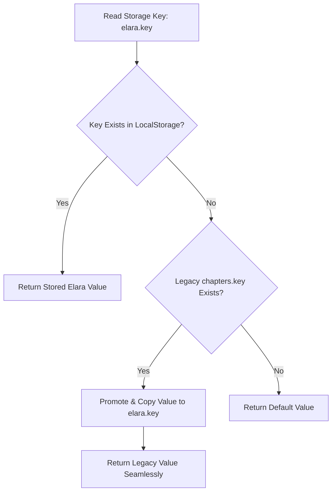

# Phase 2: Client SPA Presentation, Copy & LocalStorage Migration Plan

**Date**: 2026-10-03  
**Scope**: Complete inventory and phased technical specification for rebranding all client-side copy, headings, onboarding dialogues, settings, repository blurbs, and non-destructive localStorage preferences across the web application from Chapters to **Elara**.  
**Related Vault Notes**: `rebranding/phase-2-client-presentation-and-storage-plan`, `rebranding/phase-1-brand-assets-plan`, `rebranding/blueprint-overall-plan`, `spec/2026-10-03-chapters-to-elara-rebrand-master-plan`.  

---

> [!IMPORTANT]
> **Core Constraints Mandated by User**:
> 1. **Zero Color / Palette Changes**: All themes, styles, layout classes, and design tokens remain 100% identical.
> 2. **Name Replacement Only**: Only occurrences of "Chapters" are updated to "Elara".
> 3. **Non-Destructive LocalStorage Migration**: Users returning to the browser must retain all their sidebar states, view preferences, folder groupings, and custom colors without reset or loss.
> 4. **Approval Gate Active**: Strictly zero code execution until all phases are completely planned and formally approved.

---

## 1. Client Copy & Heading Inventory (Exact Files & Lines)

Across `client/src`, 13 components and pages contain user-facing mentions of Chapters:

| # | Component / Page | File Location & Line | Current Copy | Target Copy (`Elara`) |
| :---: | :--- | :--- | :--- | :--- |
| **1** | **Setup Page** | `client/src/pages/auth/SetupPage.tsx:46` | `<AuthFrame eyebrow="first run" title="Set up Chapters">` | `title="Set up Elara"` |
| **2** | **Pending Approval** | `client/src/pages/auth/PendingApprovalPage.tsx:11,18` | `title="Welcome to Chapters"`<br/>`Welcome to Chapters...! Your account has been created...` | `title="Welcome to Elara"`<br/>`Welcome to Elara...! Your account has been created...` |
| **3** | **Vaults Cloud Sync Notice** | `client/src/pages/VaultsPage.tsx:907` | `...saved to your Chapters account and automatically stay in sync across your Mac, Windows laptop, and all browsers.` | `...saved to your Elara account...` |
| **4** | **Appearance Settings** | `client/src/components/settings/AppearanceSection.tsx:43` | `How Chapters looks on this device. The choice is saved in this browser only.` | `How Elara looks on this device. The choice is saved in this browser only.` |
| **5** | **MFA Authenticator Prompt** | `client/src/components/settings/MfaSection.tsx:187,238` | `Add Chapters to your authenticator app...`<br/>`...Set it up to carry on using Chapters.` | `Add Elara to your authenticator app...`<br/>`...Set it up to carry on using Elara.` |
| **6** | **Connect Repo Dialog** | `client/src/components/repositories/ConnectRepositoryDialog.tsx:35,40,105,124` | • `Chapters clones the remote...`<br/>• `Chapters indexes a folder...`<br/>• `Chapters reads code and never writes it back...`<br/>• `How should Chapters get the code?` | • `Elara clones the remote...`<br/>• `Elara indexes a folder...`<br/>• `Elara reads code and never writes it back...`<br/>• `How should Elara get the code?` |
| **7** | **Repository Settings** | `client/src/components/repositories/RepositorySettingsDialog.tsx:129,200` | • `The name is Chapters' own label...`<br/>• `...everything Chapters indexed from it...` | • `The name is Elara's own label...`<br/>• `...everything Elara indexed from it...` |
| **8** | **Repository Share List** | `client/src/components/repositories/RepositoryShareList.tsx:220` | `...because Chapters never writes code back...` | `...because Elara never writes code back...` |
| **9** | **Repository Sync Status** | `client/src/components/repositories/RepositorySyncCard.tsx:33,147,187` | • `Chapters does not read connected folders yet...`<br/>• `Chapters is indexing this repository right now.`<br/>• `...Chapters is polling this remote on a schedule...` | • `Elara does not read connected folders yet...`<br/>• `Elara is indexing this repository right now.`<br/>• `...Elara is polling this remote on a schedule...` |
| **10** | **Symbol Outline Empty State** | `client/src/components/repositories/SymbolOutline.tsx:43` | `No symbols in this file. Chapters extracts an outline only from the languages it parses...` | `...Elara extracts an outline only from the languages it parses...` |
| **11** | **Webhook Setup Card** | `client/src/components/repositories/WebhookSetupCard.tsx:83` | `No webhook yet — Chapters polls this remote on a schedule...` | `...Elara polls this remote on a schedule...` |
| **12** | **Code Viewer Invariant Tooltip** | `client/src/components/repositories/CodeViewer.tsx:164` | `title="Chapters never writes code back — git stays the record of truth."` | `title="Elara never writes code back — git stays the record of truth."` |
| **13** | **Repos / Repository Empty States** | `client/src/pages/ReposPage.tsx:511`<br/>`client/src/pages/RepositoryPage.tsx:200` | `Chapters never writes code back — git stays the record of truth.` | `Elara never writes code back — git stays the record of truth.` |

---

## 2. Non-Destructive LocalStorage Migration Specification

The client application persists 22 user preferences across `localStorage`. To prevent user disruption, a dual-read transparent fallback pattern is specified:



### Complete LocalStorage Key Transition Matrix:

| Subsystem | Legacy Key (`Chapters`) | Canonical Key (`Elara`) | File Location |
| :--- | :--- | :--- | :--- |
| **Shell Sidebar** | `chapters.shell.sidebar` | `elara.shell.sidebar` | `client/src/components/shell/ShellProvider.tsx` |
| **Appearance Theme** | `chapters.theme` | `elara.theme` | `client/src/lib/theme.ts` |
| **Chunk Auto-Reload** | `chapters_chunk_reload` | `elara_chunk_reload` | `client/src/main.tsx`, `client/src/router.tsx` |
| **Vaults View Mode** | `chapters_vaults_view` | `elara_vaults_view` | `client/src/pages/VaultsPage.tsx` |
| **Vaults Folders Toggle** | `chapters_vaults_group_by_folder` | `elara_vaults_group_by_folder` | `client/src/pages/VaultsPage.tsx` |
| **Notes View Mode** | `chapters_notes_view_mode` | `elara_notes_view_mode` | `client/src/pages/vault/VaultNotesPage.tsx` |
| **Notes Folders Toggle** | `chapters_notes_group_by_folder` | `elara_notes_group_by_folder` | `client/src/pages/vault/VaultNotesPage.tsx` |
| **Repos View Mode** | `chapters_repos_view_mode` | `elara_repos_view_mode` | `client/src/pages/ReposPage.tsx` |
| **Repos Folders Toggle** | `chapters_repos_group_by_folder` | `elara_repos_group_by_folder` | `client/src/pages/ReposPage.tsx` |
| **Custom Palette** | `chapters_custom_palette` | `elara_custom_palette` | `client/src/components/vault/CustomColorPickerDialog.tsx` |
| **Vault Storage Mode** | `chapters_vault_storage_mode` | `elara_vault_storage_mode` | `client/src/components/vault/useVaultFolders.ts` |
| **Vault Folders Structure**| `chapters_vault_folders` | `elara_vault_folders` | `client/src/components/vault/useVaultFolders.ts` |
| **Folder Colors** | `chapters_folder_colors` | `elara_folder_colors` | `client/src/components/vault/useVaultFolders.ts` |
| **Vault Card Colors** | `chapters_vault_colors` | `elara_vault_colors` | `client/src/components/vault/useVaultFolders.ts` |
| **Vault Favorites** | `chapters_vault_favorites` | `elara_vault_favorites` | `client/src/components/vault/useVaultFolders.ts` |
| **Note Folders (per vault)**| `chapters_note_folders_${vaultId}` | `elara_note_folders_${vaultId}` | `client/src/components/vault/useNoteFolders.ts` |
| **Note Folder Colors** | `chapters_note_folder_colors_${vaultId}`| `elara_note_folder_colors_${vaultId}` | `client/src/components/vault/useNoteFolders.ts` |
| **Note Colors** | `chapters_note_colors_${vaultId}` | `elara_note_colors_${vaultId}` | `client/src/components/vault/useNoteFolders.ts` |
| **Note Favorites** | `chapters_note_favorites_${vaultId}`| `elara_note_favorites_${vaultId}` | `client/src/components/vault/useNoteFolders.ts` |
| **Note Editor Width** | `chapters:note-width-preference` | `elara:note-width-preference` | `client/src/components/vault/note-toolbar-utils.ts` |
| **Default Text Direction**| `chapters:note-direction-default`| `elara:note-direction-default` | `client/src/components/vault/note-toolbar-utils.ts` |
| **Scoped Text Direction** | `chapters:note-direction:${id}:${p}`| `elara:note-direction:${id}:${p}` | `client/src/components/vault/note-toolbar-utils.ts` |

### Zero-Dependency Migration Helper (`client/src/lib/storage.ts`):
```typescript
export function getMigratedStorageItem(canonicalKey: string, legacyKey: string): string | null {
  const canonical = localStorage.getItem(canonicalKey)
  if (canonical !== null) return canonical

  const legacy = localStorage.getItem(legacyKey)
  if (legacy !== null) {
    localStorage.setItem(canonicalKey, legacy)
    return legacy
  }

  return null
}
```

---

## 3. Unit Test Verification Plan

All corresponding client Vitest test suites will be updated and verified:

1. **`client/src/pages/auth/PendingApprovalPage.test.tsx`**:
   - Update heading assertion: `expect(screen.getByRole('heading', { name: /Welcome to Elara/i })).toBeInTheDocument()`.
2. **`client/src/components/settings/MfaSection.test.tsx`**:
   - Update OTP URI fixture: `otpauth://totp/Elara:reader@example.com?secret=...&issuer=Elara`.
3. **`client/src/components/vault/useVaultFolders.test.ts`**:
   - Assert storage reads and writes target `elara_vault_folders` and `elara_vault_storage_mode`.
4. **`client/src/components/vault/CustomColorPickerDialog.test.tsx`**:
   - Assert custom palette storage key is `elara_custom_palette`.
5. **`client/src/pages/RepositoryPage.test.tsx` & `RepositorySettingsDialog.test.tsx`**:
   - Update mock repository name fixtures and headings from `'Chapters'` to `'Elara'`.
