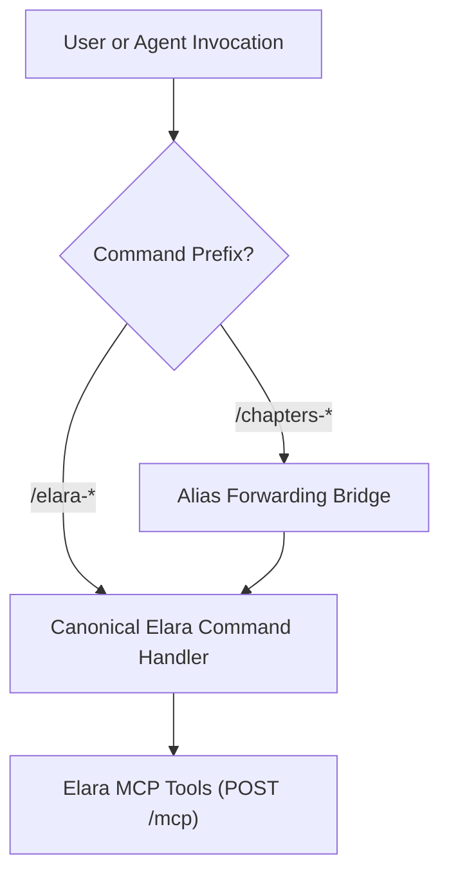

# Phase 3: Agent Skills, MCP Engineering Prompts & Slash Aliases Plan

**Date**: 2026-10-03  
**Scope**: Complete identification and technical migration plan for the AI Agent Skills subsystem (`skills/chapters` $\rightarrow$ `skills/elara`), dual-registered slash commands with legacy forwarding aliases, all 20 first-class MCP Engineering Prompts in `prompts.ts`, and multi-platform persistent installer scripts.  
**Related Vault Notes**: `rebranding/phase-3-agent-skills-and-mcp-prompts-plan`, `rebranding/phase-2-client-presentation-and-storage-plan`, `rebranding/phase-1-brand-assets-plan`, `rebranding/blueprint-overall-plan`.  

---

> [!IMPORTANT]
> **Core Constraints Mandated by User**:
> 1. **Zero Breaking Changes for AI Agents**: All existing agents configured with legacy paths or slash commands must continue functioning seamlessly via alias forwarding and backward-compatible symlinks.
> 2. **Name Replacement Only**: Update occurrences of "Chapters" to "Elara" across skills, rules, prompts, and documentation.
> 3. **Documentation Preservation**: Archiving historical records; zero file deletions.
> 4. **Approval Gate Active**: Strictly zero code or prompt execution until all phases are completely planned and formally approved.

---

## 1. Inventory of What Needs Changing in Phase 3

Across the agent skills and MCP prompts subsystems, 9 key files and 20 first-class engineering prompts contain 177 references to Chapters:

| # | Subsystem Component | File Location | References | Current State (`Chapters`) | Target State (`Elara`) |
| :---: | :--- | :--- | :---: | :--- | :--- |
| **1** | **Skill Definition** | `skills/chapters/SKILL.md` | 79 | Defines Chapters MCP tools, slash commands, architecture | `skills/elara/SKILL.md` (with `skills/chapters/` proxy) |
| **2** | **MCP Prompts Suite** | `server/src/mcp/prompts.ts` | 25 | 20 prompt templates referencing Chapters second brain | Updated templates referencing Elara second brain |
| **3** | **Agent Rule Protocol** | `skills/chapters/rules/chapters.md` | 8 | Pre/post task invariants, tool usage rules | `skills/elara/rules/elara.md` |
| **4** | **Mapping Protocol** | `skills/.../codebase-mapping-protocol.md` | 16 | 5-phase OKF codebase mapping protocol | References updated to Elara vaults & repo links |
| **5** | **OKF Format Guide** | `skills/.../okf-format.md` | 29 | Google Open Knowledge Format v0.2 spec guide | Updated notes and schema references |
| **6** | **MCP Tools Spec** | `skills/.../mcp-tools.md` | 6 | 57 Chapters MCP tools reference | 57 Elara MCP tools reference |
| **7** | **Always-On Installer**| `skills/.../install-always-on.sh` | 13 | Multi-platform agent installer script | Targets Gemini, Claude, Cursor, Windsurf for Elara |
| **8** | **Prompts Test Suite** | `server/test/mcp-prompts.test.ts` | 8 | Tests for prompt hydration and token limits | Asserts Elara prompt contents |
| **9** | **MCP Server Identity**| `server/src/mcp/server.ts` | 1 | `new McpServer({ name: 'chapters', version: '0.1.0' })` | `new McpServer({ name: 'elara', version: '0.2.0' })` |

---

## 2. Slash Command Architecture (Dual-Registration & Forwarding)

To preserve muscle memory, existing automated scripts, and active agent threads, the slash command architecture introduces canonical `/elara-*` handlers while registering `/chapters-*` as permanent forwarding aliases:

### Complete Command & Alias Matrix:

| Canonical Command (`Elara`) | Backward-Compatible Alias | Backing MCP Tool(s) | Description |
| :--- | :--- | :--- | :--- |
| **`/elara-status`** | `/chapters-status` | `list_vaults`, `list_repositories`, `list_notifications` | Check connection, active vaults, and connected repos |
| **`/elara-search`** | `/chapters-search` | `search` | Hybrid lexical + vector semantic search |
| **`/elara-symbols`** | `/chapters-symbols` | `find_symbols` | AST code symbol declaration search across repositories |
| **`/elara-graph`** | `/chapters-graph` | `graph` | Traversal, backlinks, and Louvain community clusters |
| **`/elara-path`** | `/chapters-path` | `find_graph_path` | Shortest conceptual path between notes/code |
| **`/elara-perspective`** | `/chapters-perspective` | `list/save/delete_graph_perspective` | Filter presets and scoped graph perspectives |
| **`/elara-prompt`** | `/chapters-prompt` | MCP Prompts Engine | Hydrate one of the 20 first-class prompts |
| **`/elara-note`** | `/chapters-note` | `read/create/edit/rename/delete_note` | CRUD & revision history operations on notes |
| **`/elara-repo`** | `/chapters-repo` | `browse/read_file/sync/status` | Codebase explorer and sync control |
| **`/elara-vault`** | `/chapters-vault` | `list/browse/create_vault` | Vault structure and merged-graph preferences |
| **`/elara-map`** | `/chapters-map` | 5-Phase OKF Mapping Protocol | Map codebase into interconnected OKF bundle |
| **`/elara-export`** | `/chapters-export` | `export_vault`, `export_note` | Export vault zip archive or single note markdown |

---

## 3. MCP Engineering Prompts Suite Migration (All 20 Prompts)

All 20 prompts in `server/src/mcp/prompts.ts` will be updated to anchor agents to **Elara**:

1. **`active_project_companion`**:
   - *"You are actively pairing on project '{projectName}' using Elara as the project's living second brain."*
   - *"CONTINUOUS CAPTURE: As you make architectural decisions, discover invariants, or modify code, IMMEDIATELY record them in Elara notes."*
2. **`sync_local_docs_to_vault`**:
   - Scans project docs and uploads to Elara vault: *"call Elara MCP create_note or edit_note"*.
3. **`plan_feature_implementation`**:
   - Inspects existing specs in Elara: *"RELEVANT SPECIFICATIONS IN ELARA"*, *"List which documentation notes in Elara should be updated"*.
4. **`draft_adr`**:
   - Synthesizes OKF Architecture Decision Record ready for Elara: `author: Elara Agent`.
5. **`explain_code_architecture`**:
   - Traces code back to architectural design docs and ADRs in Elara.
6. **`onboard_subsystem`**:
   - Generates subsystem onboarding guide grounded in Elara knowledge graph.
7. **`summarize_concept_chain`**:
   - Uses `find_graph_path` to connect two distinct concepts or code files in Elara.
8. **`audit_architecture_drift`**:
   - Compares documented Elara specifications against live code AST symbols.
9. **`refactor_impact_analysis`**:
   - Traces backlinks and call sites to calculate blast radius using Elara graph.
10. **`audit_orphaned_code`**:
    - Identifies architectural dark matter: critical code modules lacking documentation in Elara.
11. **`test_gap_analysis`**:
    - Audits core domain notes and specs in Elara against existing test suites.
12. **`pr_review_against_specs`**:
    - Evaluates PR diffs against established ADRs and invariants in Elara: *"What notes in Elara need to be updated before this PR merges?"*.
13. **`generate_release_notes`**:
    - Compiles release notes from recent Elara notes, ADRs, and git commits.
14. **`audit_security_surface`**:
    - Analyzes ingress routes and trust boundaries in the Elara graph.
15. **`database_schema_evolution`**:
    - Reviews data models against Elara data model notes.
16. **`supernode_bottleneck_audit`**:
    - Identifies architectural supernodes using Elara graph centrality.
17. **`incident_postmortem`**:
    - Structures blameless post-mortem notes stored in Elara.
18. **`generate_api_spec`**:
    - Generates REST or MCP OpenAPI specifications from code entrypoints.
19. **`prepare_task_context`**:
    - Bundles relevant notes, AST symbols, and graph context for upcoming tasks.
20. **`draft_rfc`**:
    - Generates Request for Comments with rollout and risk plans in Elara.

---

## 4. Multi-Platform Installer Migration (`install-always-on.sh`)

The persistent rule installer will support both new Elara setups and automatic migration from legacy Chapters setups:

- **Google Gemini / Antigravity**:
  Installs `~/.gemini/config/rules/elara.md` (removes deprecated `chapters.md`).
- **Anthropic Claude**:
  Appends Elara Always-Active Protocol to `~/.claude/CLAUDE.md`.
- **Cursor**:
  Creates `.cursor/rules/elara.mdc` (`alwaysApply: true`).
- **Windsurf**:
  Appends Elara Always-Active Protocol to `.windsurfrules`.

---

## 5. Test Suite Verification Plan

1. **`server/test/mcp-prompts.test.ts`**:
   - Verify prompt registration: `expect(prompts).toHaveLength(20)`.
   - Verify prompt content: `expect(text).toContain('You are actively pairing on project "chapters" using Elara as the project\'s living second brain')`.
   - Verify token budget compliance across all 20 prompts.
2. **Backward-Compatibility Verification**:
   - Test invoking both `/elara-search` and `/chapters-search` to verify transparent routing.
