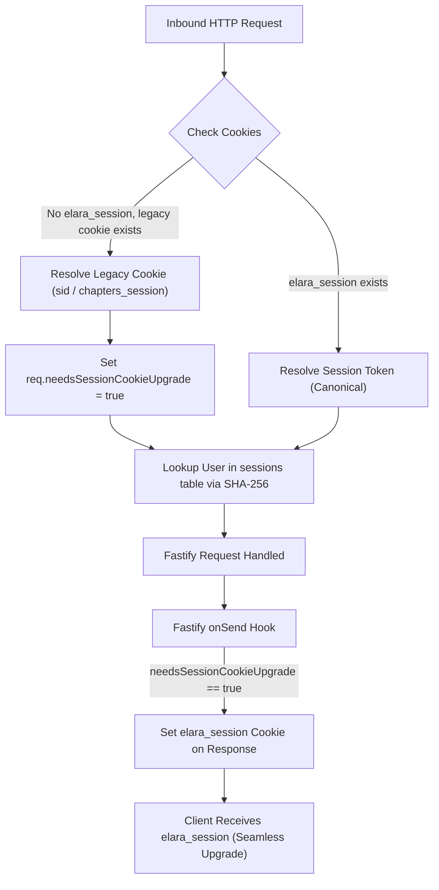

# Phase 5: Server API Ingress, Yjs CRDT Relay, Session Cookies & Auth Architecture Plan

**Date**: 2026-10-03  
**Scope**: In-depth architectural synthesis and zero-downtime transition specification for Fastify API ingress, dual-cookie session management, Hocuspocus / Yjs collaboration WebSocket relay, MCP server identity negotiation, transactional emails, and PostgreSQL schema integrity from Chapters to **Elara**.  
**Related Vault Notes**: `rebranding/phase-5-server-api-relay-cookies-and-auth-plan`, `rebranding/phase-4-package-names-docker-and-env-vars-plan`, `rebranding/phase-3-agent-skills-and-mcp-prompts-plan`, `rebranding/phase-2-client-presentation-and-storage-plan`, `rebranding/phase-1-brand-assets-plan`, `rebranding/blueprint-overall-plan`.  

---

> [!IMPORTANT]
> **Core Constraints Mandated by User**:
> 1. **Zero Session Disruption**: Active authenticated users must not be logged out during or after deployment.
> 2. **Zero CRDT Split-Brain**: Two users editing the same note must never be partitioned into separate Yjs rooms.
> 3. **Zero Wire Breaking Changes for MCP**: Claude Desktop, Cursor, and Gemini CLI connections must continue working without breaking.
> 4. **Zero Schema Migrations**: PostgreSQL tables, foreign keys, and enums remain 100% stable with zero Drizzle drift.
> 5. **Approval Gate Active**: Strictly zero code execution until all planning phases are finished and approved.

---

## 1. Multi-Agent Audit Findings & Architectural Realities

A multi-agent deep audit of the server and client codebase revealed critical system realities:

1. **Stateful Database Sessions (Not Stateless JWTs)**:
   - Sessions are 32-byte cryptographic random hex strings (`randomBytes(32)`), stored as SHA-256 hashes in the PostgreSQL `sessions` table.
   - The primary session cookie is `sid` (`HttpOnly: true`, `SameSite: 'lax'`, `Secure: isProd`, `Max-Age: 30 days`).
   - JWTs are used **only** for external OpenID Connect (OIDC) identity provider token verification via `jose.jwtVerify`.
2. **Yjs Room Scoping is Already Brand-Neutral**:
   - Hocuspocus document names are constructed strictly as `${vaultId}/${path}` (`client/src/api/collab.ts:38`).
   - There is **no brand prefix** in room names. Retaining `${vaultId}/${path}` completely prevents CRDT split-brain.
3. **MCP Wire Protocol Independence**:
   - In Model Context Protocol JSON-RPC handshakes, `serverInfo.name` is purely metadata for client UI display.
   - Tool names over the wire (`search`, `read_note`, `create_note`, `find_symbols`) and bearer tokens are completely unprefixed. Renaming `serverInfo.name` to `'elara'` will **not break** active MCP clients.
4. **PostgreSQL Enums & Schema Stability**:
   - None of the 11 database enums contain "chapters" or brand names.
   - `actor_type` (`'user' | 'mcp' | 'collab'`) is an execution classification, not a brand attribute.
   - All foreign keys rely strictly on UUIDs. **Zero schema migrations are required**.

---

## 2. Dual-Cookie Session Management Architecture

To transition session cookies without invalidating active users or forcing re-logins, a 3-tier dual-read and rolling-promotion architecture is specified:



### Technical Specification:

1. **Fastify Ingress Hook (`server/src/auth/plugin.ts`)**:
   ```typescript
   export const SESSION_COOKIE = 'elara_session'
   export const LEGACY_SESSION_COOKIES = ['chapters_session', 'sid'] as const

   app.addHook('onRequest', async (req) => {
     let token = req.cookies[SESSION_COOKIE]
     let isLegacy = false

     if (!token) {
       for (const legacyName of LEGACY_SESSION_COOKIES) {
         if (req.cookies[legacyName]) {
           token = req.cookies[legacyName]
           isLegacy = true
           break
         }
       }
     }

     if (token) {
       req.sessionToken = token
       req.user = await getSessionUser(token)
       if (req.user && isLegacy) {
         req.needsSessionCookieUpgrade = true
       }
     }
   })
   ```
2. **Rolling Upgrade via `onSend` Hook**:
   When a user makes any authenticated request with a legacy cookie, the server automatically attaches the new `elara_session` cookie to the response. The user's active session is never interrupted.
3. **Comprehensive Invalidation on Logout (`server/src/auth/routes.ts`)**:
   ```typescript
   app.post('/logout', { preHandler: app.requireAuth }, async (req, reply) => {
     if (req.sessionToken) await destroySession(req.sessionToken)
     return reply
       .clearCookie('elara_session', { path: '/' })
       .clearCookie('chapters_session', { path: '/' })
       .clearCookie('sid', { path: '/' })
       .send({ status: 'logged_out' })
   })
   ```

---

## 3. Real-Time Collaboration (Yjs / Hocuspocus) Transition

### 3.1 WebSocket Ingress Path Compatibility
- **Canonical Route**: `COLLAB_PATH = '/collab'`.
- To prevent reverse proxy failures (Nginx / Cloudflare `location /collab`), the server continues intercepting raw HTTP upgrades on `/collab` while registering `/elara-collab` as an allowed upgrade route:
  ```typescript
  const ALLOWED_UPGRADES = new Set(['/collab', '/elara-collab'])
  ```
- Protect both paths in `static.ts` `RESERVED = ['/api', '/collab', '/elara-collab', '/mcp', '/repositories']`.

### 3.2 Split-Brain Prevention Invariant
- **Rule**: Document names remain strictly `${vaultId}/${path}`.
- **Why**: Hocuspocus keys in-memory documents on `documentName`. If room names were rebranded to `elara:${vaultId}/${path}`, clients running on different builds would edit separate in-memory documents, causing catastrophic file clobbering.
- Keeping `${vaultId}/${path}` guarantees 100% convergence across rolling updates.

### 3.3 Client Reconnection Resilience (`client/src/hooks/useCollabDoc.ts`)
- Differentiate between **403 Forbidden** (true access revocation) and transient rollout reconnect failures.
- Introduce a 3-attempt reconnect budget with jitter before declaring a document `revoked`, ensuring active editors do not see false "revoked" screens during server restarts.

---

## 4. MCP Server Identity & Ingress Negotiation

In `server/src/mcp/server.ts`:
- Update MCP server initialization:
  ```typescript
  const server = new McpServer({ name: 'elara', version: '0.2.0' })
  ```
- **Dual Ingress Endpoints (`server/src/mcp/routes.ts`)**:
  - Maintain `POST /mcp` permanently.
  - Register `POST /elara/mcp` as an alias.
  - Existing client configurations in Claude Desktop, Cursor, and Gemini CLI pointing to `/mcp` continue working without modification.

---

## 5. Transactional Emails & Database Backfill

1. **Email Templates**:
   - `server/src/email/welcome.ts`: Subject updated to `"Welcome to Elara — your account is active"`, body text updated to introduce Elara.
   - `server/src/auth/routes.ts`: Subjects updated to `"Elara: verify your email"` and `"Elara: password reset"`.
   - `server/src/auth/mfa.ts`: TOTP `issuer: 'Elara'`. (Under RFC 6238, TOTP computation relies strictly on the secret key and timestamp; existing authenticator apps continue generating valid codes).
2. **Notification Backfill**:
   - Pre-existing rows in PostgreSQL `notifications` table containing "Chapters" can be updated via a non-blocking SQL statement:
     ```sql
     UPDATE notifications
     SET message = REPLACE(message, 'Chapters', 'Elara')
     WHERE message LIKE '%Chapters%';
     ```
   - New notifications emitted by `admin-routes.ts` use `"Your Elara account has been approved..."`.
3. **Server Startup Banners**:
   - `server/src/index.ts`:
     - `=== Elara one-time setup token: ${setupToken} ===`
     - `Elara server listening on :${config.port} (collab on ${COLLAB_PATH})`
   - Backup pruning regex in `backup-service.ts`: `/^(?:chapters|elara)-backup-.*\.zip$/`.

---

## 6. Verification Plan for Phase 5

1. **Session Continuity Test**:
   - Inject a legacy `sid` cookie into an authenticated session; verify that requests succeed and receive `elara_session` in `Set-Cookie`.
2. **Logout Multi-Purge Test**:
   - Call `/api/logout`; verify all cookies (`elara_session`, `chapters_session`, `sid`) are cleared.
3. **CRDT Live Co-Editing Test**:
   - Open two browser tabs on the same note; verify real-time typing convergence over `/collab`.
4. **MCP Wire Compatibility Test**:
   - Post MCP `initialize` JSON-RPC handshake to `/mcp`; verify `serverInfo: { name: 'elara', version: '0.2.0' }` and successful execution of `search` and `read_note`.
5. **MFA Continuity Test**:
   - Verify existing TOTP authenticator seeds generate valid codes accepted by the server.
