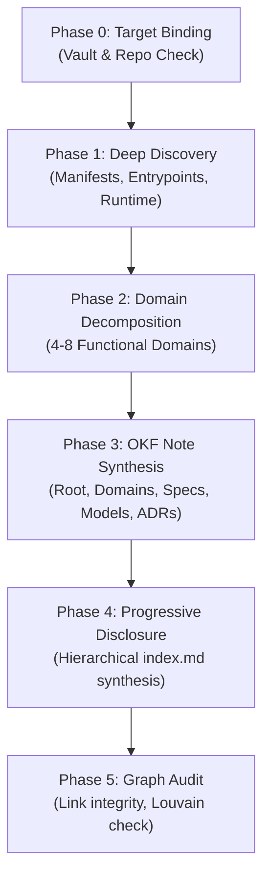

# Chapters Flawless Codebase Mapping Protocol (OKF v0.2)

This document defines the deterministic, 5-phase protocol for AI agents mapping any software project or codebase repository into an interconnected, Open Knowledge Format (OKF v0.2) Knowledge Bundle within Chapters.

Specification standards:
- [GoogleCloudPlatform/open-knowledge-format](https://github.com/GoogleCloudPlatform/open-knowledge-format)
- [Chapters OKF Specification](okf-format.md)

---

## 1. Core Principles of Flawless Mapping

A flawless codebase map is **not** a raw file inventory or automated documentation dump. It is an **executable mental model** structured into Google's Open Knowledge Format (OKF) with high topological density:

1. **Architecture Over Inventory**: Map system responsibilities, domain boundaries, data flows, and non-negotiable invariants — never generate redundant one-line summaries for every single file.
2. **Direct Code Deep-Links**: Every concept, model, and flow must link directly to the implementation file using Chapters repository wikilinks: `[[repo:<repo-id>/path/to/file]]` or line ranges `[[repo:<repo-id>/path/to/file#L12-L34]]`.
3. **High-Density Bidirectional Wikilinks**: Concepts must link to related concepts (`[[concepts/other-concept]]`) so the Chapters graph engine generates meaningful Louvain community clusters and PageRank weights.
4. **Hierarchical Progressive Disclosure**: Organize the bundle into standard folders (`domains/`, `specs/`, `models/`, `decisions/`) where every folder contains an `index.md` summarizing its contents. This allows agents to explore deep systems level-by-level without exhausting LLM context windows.
5. **Strict OKF Frontmatter**: Every note must carry valid YAML frontmatter with `type`, `title`, `description`, `tags`, `status`, `generated` (agent attribution), and `sources` (code provenance).
6. **Zero Dead Links & Zero Orphans**: Every note must link to at least two other notes, and all wikilinks must resolve cleanly.

---

## 2. The 5-Phase Mapping Algorithm

When executing `/chapters-map <repo-id-or-path> [--vault <vault-id>] [--name <vault-name>]`:



---

### Phase 0: Target Vault & Repository Binding

1. **Resolve Repository**:
   - Check if the repository is already connected using Chapters MCP `list_repositories`.
   - If not connected, connect it using `connect_repository` (providing git URL or local path).
   - Retrieve the exact repository ID (e.g. `chapters`, `repo-uuid`).
2. **Resolve Vault**:
   - If `--vault <vault-id>` is provided, verify it exists using `list_vaults`.
   - If no vault ID is provided, look for an existing vault matching the project name (e.g., `Project Documentation` or `Codebase Map`).
   - If none exists, create a dedicated vault using `create_vault` with a descriptive name (e.g., `Chapters Architecture`).
   - Record the target `vaultId`.

---

### Phase 1: Deep Project Discovery & Manifest Analysis

1. **Ingest Build Manifests & Runtime Configurations**:
   - Read top-level package definitions and lockfiles (`package.json`, `Cargo.toml`, `go.mod`, `pyproject.toml`, `pom.xml`, `build.gradle`, `mix.exs`).
   - Detect:
     - Primary language(s) and runtime versions (Node.js 24+, Rust 1.80, Go 1.22, Python 3.12).
     - Web and API frameworks (Fastify, Express, Actix, Gin, FastAPI, React 19, Next.js).
     - Storage and ORM layers (PostgreSQL, SQLite, Drizzle ORM, Prisma, Diesel, Redis).
     - Infrastructure specifications (`Dockerfile`, `docker-compose.yml`, Kubernetes manifests, GitHub Actions CI workflows).
2. **Discover All Ingress Entrypoints**:
   - Identify every external communication boundary:
     - HTTP REST/GraphQL server bootstrap.
     - WebSocket and real-time streaming handlers.
     - CLI entrypoints and command binaries.
     - Model Context Protocol (MCP) server endpoints.
     - Background queues, cron schedulers, and event listeners.
3. **Discover Core Data Structures & Models**:
   - Locate database migration files, ORM schema definitions, and protocol buffer/OpenAPI schemas.

---

### Phase 2: Architectural Domain Decomposition

Partition the codebase into **4 to 8 cohesive functional domains**. Do not create a flat list of 50 folders. Group by cohesive bounded context:

| Standard Domain Pattern | Typical Scope & Responsibilities | Key Artifacts |
| :--- | :--- | :--- |
| **Auth & Security** | Identity, session validation, MFA, RBAC permissions, token signing, trust boundaries. | Sessions, passwords, cookies, token verification. |
| **Data & Storage** | Database schema, ORM mappings, migrations, transactional integrity, soft delete. | Schemas, repositories, connection pooling. |
| **API & Ingress** | HTTP routes, WebSocket relays, rate limiting, request validation, serialization. | Fastify/Express routes, route controllers. |
| **Core Domain Engine** | Business logic, state machines, algorithms, domain calculation models. | Core services, domain logic, calculators. |
| **Real-time / Messaging** | CRDT synchronization, pub/sub buses, event emitters, background queues. | Yjs, WebSockets, event handlers. |
| **Agent / MCP Layer** | Model Context Protocol tools, agent prompt bindings, tool security scoping. | MCP servers, tool handlers, SDK hooks. |
| **Client / UI** | Frontend SPA shell, router, component state matrix, styling, layout rails. | React components, stores, design tokens. |

For each domain, define:
- **Lead Implementation File**: The primary orchestrator file for that domain.
- **Critical Interfaces / Types**: Data shapes exchanged across domain boundaries.
- **Invariants**: Hard rules that must never be broken (e.g., "all mutations require edit permission").

---

### Phase 3: Structured OKF Note Synthesis

Create notes inside the target vault using Chapters MCP `create_note`. Every note must strictly adhere to the [OKF v0.2 Specification](okf-format.md).

#### Template 1: Root System Architecture Index (`index.md`)

Location: `index.md`
```markdown
---
type: System Architecture
title: "[Project Name] Architecture & Knowledge Map"
description: "Comprehensive architectural map, subsystem breakdown, and navigation index for [Project Name]."
resource: "https://github.com/[org]/[repo]"
tags: [architecture, overview, index, system-map]
status: active
generated:
  by: "agent:antigravity"
  at: "YYYY-MM-DDTHH:MM:SSZ"
sources:
  - id: repo-root
    resource: "repo:[repo-id]/package.json"
    title: "Project Manifest"
---

# [Project Name] Architecture & Knowledge Map

## 1. System Overview
[Executive summary of the project's purpose, design philosophy, deployment model, and core value proposition.]

## 2. Architectural Domains
| Domain | Lead File | Responsibility |
| :--- | :--- | :--- |
| [[domains/auth-security/index\|Auth & Security]] | `[[repo:[repo-id]/src/auth/session.ts]]` | User authentication, sessions, and RBAC permissions. |
| [[domains/data-storage/index\|Data & Storage]] | `[[repo:[repo-id]/src/db/schema.ts]]` | PostgreSQL persistence, Drizzle schemas, and migrations. |
| [[domains/api-surface/index\|API & Ingress]] | `[[repo:[repo-id]/src/app.ts]]` | HTTP routes, WebSocket relay, and security middleware. |
| [[domains/mcp-layer/index\|Agent & MCP Layer]] | `[[repo:[repo-id]/src/mcp/server.ts]]` | Model Context Protocol server exposing 49 agent tools. |

## 3. Primary Ingress Entrypoints
- `[[repo:[repo-id]/src/index.ts]]` — Application bootstrap, configuration, and HTTP listener.
- `[[repo:[repo-id]/src/mcp/server.ts]]` — Standalone Model Context Protocol server.
- `[[repo:[repo-id]/client/src/main.tsx]]` — Frontend single-page application bootstrap.

## 4. End-to-End Workflow Specifications
- [[specs/data-mutation-lifecycle|Data Mutation & Collaborative Write Path]]
- [[specs/authentication-flow|User Authentication & Session Validation Flow]]
- [[specs/repository-sync-flow|Codebase Repository Ingestion & Sync Pipeline]]

## 5. Technology Stack & Key Dependencies
| Tier | Technology | Rationale |
| :--- | :--- | :--- |
| **Runtime** | Node.js 24+ / TypeScript | Strict type safety end-to-end. |
| **Web Server** | Fastify 5.x | High-throughput async HTTP & WebSocket server. |
| **Database** | PostgreSQL + pgvector | ACID relational store with vector similarity search. |
| **Realtime** | Yjs + Hocuspocus | Local-first CRDT multi-user collaborative editing. |
| **AI Protocol** | Model Context Protocol (MCP) | Standardized tool and resource binding for AI agents. |
```

#### Template 2: Architectural Domain Note (`domains/<domain>/index.md`)

Location: `domains/<domain>/index.md`
```markdown
---
type: Architectural Domain
title: "Domain: [Domain Name]"
description: "Architecture, invariants, and implementation guide for the [Domain Name] subsystem."
resource: "repo:[repo-id]/src/[subsystem]"
tags: [architecture, [domain-tags]]
status: active
generated:
  by: "agent:antigravity"
  at: "YYYY-MM-DDTHH:MM:SSZ"
sources:
  - id: [lead-file]
    resource: "repo:[repo-id]/src/[subsystem]/[lead-file.ts]"
    title: "[Subsystem] Lead Implementation"
properties:
  layer: [backend | frontend | shared]
  owner: "[Team/Owner]"
---

# Domain: [Domain Name]

## 1. Overview & Boundary
[Detailed architectural rationale for this domain, what it encapsulates, and what is explicitly out of scope.]

## 2. Key Invariants & Non-Negotiable Rules
- [Invariant 1: e.g. "All writes must pass through the shared validation schema before touching disk."]
- [Invariant 2: e.g. "Token revocation kicks active WebSocket connections immediately."]
- [Invariant 3: e.g. "Single-process memory counters are maintained per instance."]

## 3. Core Components & Lead Files
- `[[repo:[repo-id]/src/[subsystem]/lead.ts]]` — Primary domain orchestrator.
- `[[repo:[repo-id]/src/[subsystem]/store.ts]]` — Persistence and query operations.
- `[[repo:[repo-id]/src/[subsystem]/types.ts]]` — Exported domain interfaces.

## 4. State Transitions & Lifecycle
[Diagram or step-by-step description of state machine transitions.]

## 5. Cross-Domain Integrations
- [[domains/data-storage/index|Data & Storage Layer]] — Persistence contract.
- [[specs/[related-spec]|Related Workflow Specification]] — Execution flow.
- [[decisions/ADR-[nnn]|Governing Architectural Decision]] — Architectural rationale.
```

#### Template 3: End-to-End Workflow Specification (`specs/<flow-name>.md`)

Location: `specs/<flow-name>.md`
```markdown
---
type: Workflow Spec
title: "Spec: [Workflow Display Name]"
description: "End-to-end execution sequence, trust boundaries, and error recovery for [Workflow Name]."
tags: [spec, workflow, data-flow]
status: active
generated:
  by: "agent:antigravity"
  at: "YYYY-MM-DDTHH:MM:SSZ"
sources:
  - id: flow-source
    resource: "repo:[repo-id]/src/[path]/[file.ts]"
    title: "[Workflow Component]"
---

# Spec: [Workflow Display Name]

## 1. Flow Summary
[High-level summary of what initiates this flow, what steps it performs, and what state it produces.]

## 2. Step-by-Step Execution Sequence
1. **Ingress**: Request received at `[[repo:[repo-id]/src/[route.ts]]]` (`POST /endpoint`).
2. **Authentication**: Identity validated against [[domains/auth-security/index|Auth Subsystem]].
3. **Validation**: Input verified against Zod schema (`[[repo:[repo-id]/src/[schema.ts]]`).
4. **Execution**: Core transaction executed in `[[repo:[repo-id]/src/[service.ts]]]`.
5. **Persistence**: State committed to database via [[domains/data-storage/index|Data Layer]].
6. **Egress & Events**: Real-time event published and HTTP 200 returned.

## 3. Trust Boundaries & Error Handling
- **Failure Mode 1**: If database connection times out, retry with exponential backoff (max 3 attempts).
- **Failure Mode 2**: If validation fails, return 400 Bad Request with field-level error matrix.

## 4. Related Specs & Concepts
- [[domains/[domain]/index|Parent Domain Note]]
- [[models/[model]|Primary Entity Note]]
```

#### Template 4: Data Model / Entity Note (`models/<model-name>.md`)

Location: `models/<model-name>.md`
```markdown
---
type: Data Model
title: "Model: [Entity Name]"
description: "Data schema, relationships, indexes, and lifecycle for the [Entity Name] entity."
resource: "repo:[repo-id]/src/db/schema.ts"
tags: [model, schema, database]
status: active
generated:
  by: "agent:antigravity"
  at: "YYYY-MM-DDTHH:MM:SSZ"
---

# Model: [Entity Name]

## 1. Entity Overview
[Description of what this entity represents in the business domain and its lifecycle.]

## 2. Schema Definition
| Field | Type | Nullable | Default | Description |
| :--- | :--- | :--- | :--- | :--- |
| `id` | UUID | No | `gen_random_uuid()` | Primary Key |
| `name` | VARCHAR(255) | No | None | Unique name within scope |
| `created_at` | TIMESTAMPTZ | No | `NOW()` | Record creation timestamp |

## 3. Relationships & Foreign Keys
- Belongs to [[models/parent-entity|Parent Entity]] via `parent_id`.
- Has many [[models/child-entity|Child Entity]] via foreign key cascade.

## 4. Code Definition
- `[[repo:[repo-id]/src/db/schema.ts#L45-L80]]` — Drizzle ORM table definition.
```

#### Template 5: Architecture Decision Record (`decisions/ADR-<nnn>-<title>.md`)

Location: `decisions/ADR-<nnn>-<title>.md`
```markdown
---
type: Architecture Decision
title: "ADR [NNN]: [Decision Title]"
description: "Architectural context, alternatives considered, and consequences for [Decision Title]."
tags: [adr, architecture, decision]
status: active # active | superseded | deprecated
generated:
  by: "agent:antigravity"
  at: "YYYY-MM-DDTHH:MM:SSZ"
---

# ADR [NNN]: [Decision Title]

## Context & Problem Statement
[What problem needed solving, what constraints existed, and why a decision was required.]

## Decision
[The chosen architectural approach and justification.]

## Consequences & Trade-offs
- **Positive**: [Benefit 1]
- **Negative / Trade-off**: [Trade-off 1]
- **Mitigation**: [How the trade-off is managed]

## Alternatives Considered
- **Alternative 1**: [Description] — Rejected because [Reason].
- **Alternative 2**: [Description] — Rejected because [Reason].

## Key Implementation Files
- `[[repo:[repo-id]/src/[path]/[file.ts]]` — Primary implementation of this decision.
```

---

### Phase 4: Progressive Disclosure & Hierarchical Indices

To conform strictly to the Google OKF v0.2 standard, **every directory must have an `index.md` file**.

1. **Root `index.md`**: Summarizes the entire system and links to each domain `domains/<domain>/index.md`.
2. **`domains/index.md`**: Lists all architectural domains with one-line descriptions.
3. **`domains/<domain>/index.md`**: Summarizes the specific domain and links to sub-concepts.
4. **`specs/index.md`**: Lists all end-to-end workflow specifications.
5. **`models/index.md`**: Lists all database models and data contracts.
6. **`decisions/index.md`**: Chronological table of all Architecture Decision Records (ADRs).

**Why this matters**: When an AI agent needs to answer a query (e.g. "How does session revocation work?"), it does not need to read 50 notes into memory. It reads `index.md` -> jumps directly to `domains/auth-security/index.md` -> reads `specs/authentication-flow.md`. This achieves sub-second retrieval with zero context bloat.

---

### Phase 5: Knowledge Graph Audit & Validation

After generating all notes in the vault, execute the automated graph audit:

1. **Wikilink Integrity Check**:
   - Verify that every `[[wikilink]]` targets an existing note path or title in the vault.
   - Verify that every `[[repo:<repo-id>/path]]` targets an actual file path in the repository.
   - Ensure zero broken links.
2. **Graph Topology Verification via Chapters MCP**:
   - Call Chapters MCP `graph` with `aggregate: "community"`.
   - Verify that:
     - The generated notes form cohesive Louvain community clusters alongside the code nodes.
     - There are **zero orphan notes** (every note has degree >= 2).
     - Central hub notes (`index.md`) exhibit high degree centrality.
3. **Search Verification via Chapters MCP**:
   - Call Chapters MCP `search` with queries representing each domain (e.g., `search("authentication token lifecycle")`).
   - Confirm that the newly generated OKF notes rank at the top of the hybrid search results.

---

## 3. Agent Execution Checklist for `/chapters-map`

When invoked to map a project, the agent must check off each milestone:

- [ ] **Target Bound**: Target repository identified (`list_repositories`) and target vault prepared (`list_vaults` / `create_vault`).
- [ ] **Manifest Analyzed**: Runtime, frameworks, databases, and ingress entrypoints parsed.
- [ ] **Domains Partitioned**: 4 to 8 bounded architectural domains identified.
- [ ] **Root Index Created**: `index.md` synthesized with full tech stack, domain table, and entrypoints.
- [ ] **Domain Notes Created**: `domains/<name>/index.md` written with invariants and `[[repo:...]]` links.
- [ ] **Workflow Specs Created**: Key execution flows documented under `specs/`.
- [ ] **Progressive Disclosure Built**: Subdirectory `index.md` files written for `domains/`, `specs/`, `models/`, and `decisions/`.
- [ ] **Links Verified**: 100% of `[[wikilinks]]` and `[[repo:...]]` references resolve cleanly.
- [ ] **Graph Verified**: Chapters MCP `graph` called to verify cohesive Louvain community clusters and zero orphan notes.
